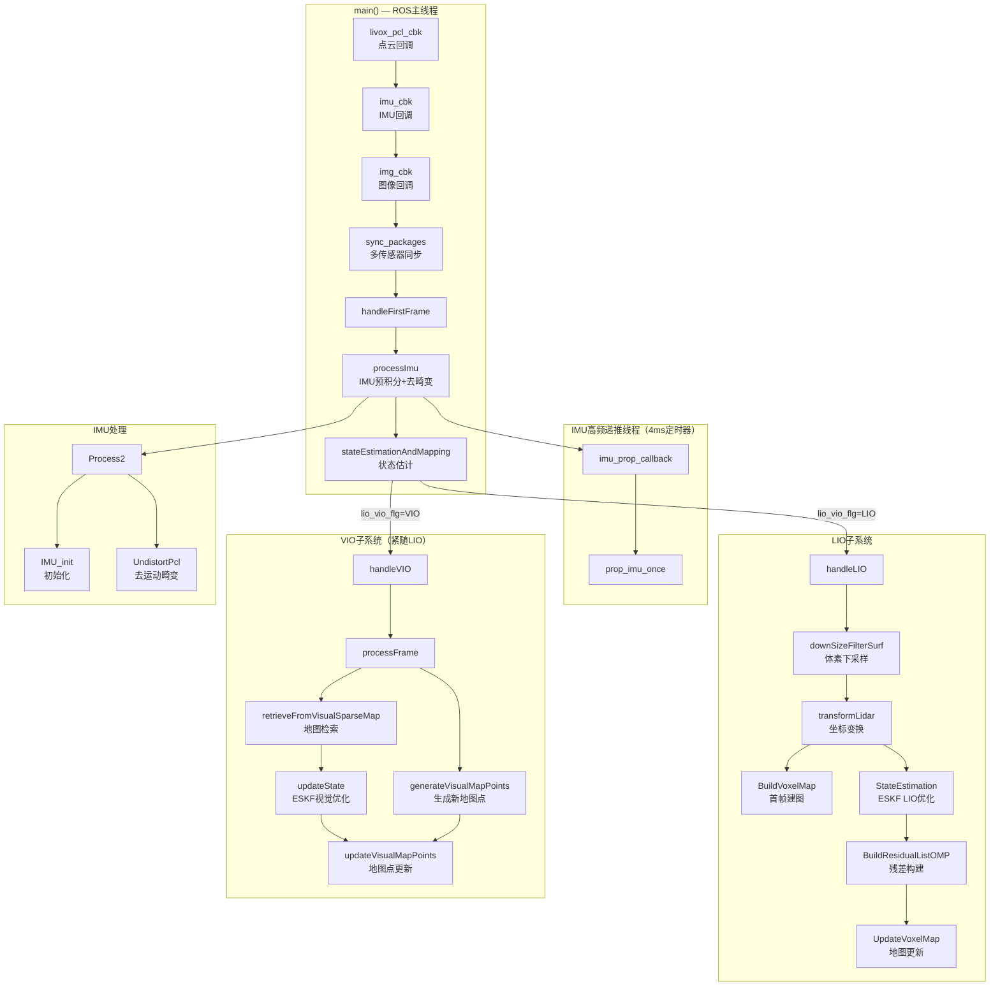

# FAST-LIVO2 超详细深度分析报告

> **项目名称：** FAST-LIVO2
> **GitHub地址：** https://github.com/hku-mars/fast-livo2
> **项目定位：** 激光雷达-惯性-视觉融合（LiDAR-Inertial-Visual Odometry）实时定位与建图
> **主要语言：** C++
> **依赖框架：** ROS、PCL、Eigen3、OpenCV、Sophus、vikit（相机模型）
> **Stars：** 4,002 | **论文：** IEEE T-RO 2024

---

## 一、代码架构与流程分析

### 1.1 项目整体架构

FAST-LIVO2 是港大 MARS Lab 开发的紧耦合激光-惯性-视觉融合 SLAM 系统，支持 Livox Avia、Ouster、Velo16、L515、Hesai XT32 等多种激光雷达，以及针孔和鱼眼相机。其设计目标是在严重退化环境（无纹理、低光照、快速运动）中实现鲁棒的实时定位与建图。

```
fast-livo2/
├── include/                           # 头文件目录
│   ├── LIVMapper.h                  # 主映射器，串联LIO+VIO
│   ├── vio.h                        # VIO子系统（视觉前端+ESKF优化）
│   ├── voxel_map.h                  # 激光点云体素地图管理
│   ├── IMU_Processing.h             # IMU数据处理与预积分
│   ├── preprocess.h                 # 激光雷达点云预处理
│   ├── common_lib.h                  # 共享数据结构（StatesGroup / MeasureGroup）
│   ├── feature.h                    # 特征点定义
│   ├── frame.h                      # 帧结构定义
│   ├── visual_point.h               # 视觉地图点定义
│   ├── livox_ros_driver/            # 定制点类型和消息格式
│   └── utils/                       # 数学工具（so3_math, types, color）
├── src/                              # 源文件目录
│   ├── main.cpp                     # ROS节点入口
│   ├── LIVMapper.cpp                # 主映射逻辑（LIVMapper类，1340行）
│   ├── vio.cpp                      # VIO核心（VIOManager类，1844行）
│   ├── voxel_map.cpp                # 体素地图（VoxelMapManager，VoxelOctoTree）
│   ├── IMU_Processing.cpp           # IMU处理（预积分+去畸变，21541字节）
│   ├── preprocess.cpp               # 点云预处理（支持多种雷达）
│   ├── frame.cpp                    # 帧实现
│   └── visual_point.cpp             # 视觉点实现
├── config/                           # YAML配置文件（avia / MARS_LVIG / NTU_VIRAL / HILTI22）
├── launch/                          # ROS launch文件
├── rviz_cfg/                        # Rviz可视化配置
├── scripts/                         # 后处理脚本（mesh生成/Colmap输出）
└── Log/                            # 日志与结果输出目录
```

#### 核心模块职责与依赖关系

| 模块 | 职责 | 依赖 | 核心文件 |
|------|------|------|---------|
| **LIVMapper** | 主协调器：多传感器同步、LIO/VIO状态分发、ROS发布 | 调度所有子系统 | `src/LIVMapper.cpp` |
| **ImuProcess** | IMU预积分、状态递推、点云去运动畸变 | common_lib, Sophus | `src/IMU_Processing.cpp` |
| **VoxelMapManager** | 激光点云体素地图构建与状态估计（ESKF） | common_lib, voxel_map.h | `src/voxel_map.cpp` |
| **VIOManager** | 直接法视觉里程计（Patch逆合成对齐 + ESKF） | common_lib, vikit | `src/vio.cpp` |
| **Preprocess** | 激光雷达点云滤波与特征提取 | PCL | `src/preprocess.cpp` |

### 1.2 核心算法流程

#### 主入口及启动流程

`src/main.cpp` 仅负责 ROS 初始化：

```cpp
// src/main.cpp
int main(int argc, char **argv) {
    ros::init(argc, argv, "laserMapping");
    ros::NodeHandle nh;
    image_transport::ImageTransport it(nh);
    LIVMapper mapper(nh);                          // 构造主映射器
    mapper.initializeSubscribersAndPublishers(nh, it);  // 注册收发话题
    mapper.run();                                 // 启动主循环
    return 0;
}
```

`LIVMapper` 构造函数 (`src/LIVMapper.cpp`) 流程：

```cpp
LIVMapper::LIVMapper(ros::NodeHandle &nh) {
    // 1. 分配核心组件
    p_pre.reset(new Preprocess());                // 雷达预处理
    p_imu.reset(new ImuProcess());                // IMU处理
    voxelmap_manager.reset(new VoxelMapManager(...));  // 体素地图
    vio_manager.reset(new VIOManager());           // VIO管理

    readParameters(nh);                           // 解析YAML参数
    initializeFiles();                            // 打开日志文件
    initializeComponents();                       // 初始化各子系统
    // initializeComponents() 中：
    //   - 加载相机内参（vikit）
    //   - 设置LiDAR-IMU外参
    //   - 设置LiDAR-Camera外参
    //   - 调用 vio_manager->initializeVIO()
    //   - 配置IMU噪声参数
}
```

#### 主循环 run() 流程

```cpp
// src/LIVMapper.cpp ~line 534
void LIVMapper::run() {
    ros::Rate rate(5000);
    while (ros::ok()) {
        ros::spinOnce();
        if (!sync_packages(LidarMeasures)) {    // 多传感器时间同步
            rate.sleep();
            continue;
        }
        handleFirstFrame();                      // 首帧标记
        processImu();                           // IMU预积分 + 去畸变
        stateEstimationAndMapping();             // LIO或VIO状态估计
    }
    savePCD();                                   // 程序结束时保存地图
}
```

### 1.3 多传感器时间同步机制

`sync_packages()` 是 FAST-LIVO2 的核心创新之一，支持三种工作模式通过 `slam_mode_` 选择：

```cpp
// src/LIVMapper.cpp ~line 840
// slam_mode_ = (img_en && lidar_en) ? LIVO :
//              imu_en ? ONLY_LIO : ONLY_LO;
```

**LIVO 模式（激光-惯性-视觉融合）**下的同步策略：

```cpp
// LIVO模式状态机 (src/LIVMapper.cpp sync_packages)
switch (meas.lio_vio_flg) {
case WAIT:
case VIO:
    // Step 1: LIO阶段 — 以图像捕获时间为基准
    // 等待 lidar + imu 数据到达图像捕获时间点
    // 将IMU累积到lio_time，压入measures队列
    // 将lidar点云按时间切分：lio_time之前→pcl_proc_cur，之后→pcl_proc_next
    meas.lio_vio_flg = LIO;
    meas.measures.push_back(m);
    return true;

case LIO:
    // Step 2: VIO阶段 — 立即处理图像帧
    // 以当前图像作为VIO输入（lio_time = lidar_end, vio_time = img_capture_time）
    meas.lio_vio_flg = VIO;
    meas.measures.push_back(m);
    return true;
}
```

时序上：**LIO 先执行 → 立即 VIO 执行**，两者共享同一 `_state`，VIO 利用 LIO 更精确的位姿作为先验。

### 1.4 IMU 预处理与点云去畸变

```cpp
// src/LIVMapper.cpp ~line 248
void LIVMapper::processImu() {
    p_imu->Process2(LidarMeasures, _state, feats_undistort); // IMU积分 + 去畸变
    // 处理结果：feats_undistort — 去除了IMU运动畸变的激光点云
    if (gravity_align_en) gravityAlignment();
    state_propagat = _state;
    voxelmap_manager->state_ = _state;
    voxelmap_manager->feats_undistort_ = feats_undistort;
}
```

`ImuProcess::Process2()` (`src/IMU_Processing.cpp`) 核心流程：

```cpp
// src/IMU_Processing.cpp
void ImuProcess::Process2(LidarMeasureGroup &lidar_meas, StatesGroup &stat,
                          PointCloudXYZI::Ptr cur_pcl_un_) {
    MeasureGroup meas = lidar_meas.measures.back();

    if (imu_need_init) {
        IMU_init(meas, stat, init_iter_num);   // 前20帧：初始化重力/零偏/噪声
        return;
    }

    UndistortPcl(lidar_meas, stat, *cur_pcl_un_);  // 去运动畸变
}
```

`UndistortPcl()` 的关键步骤：
1. 提取当前帧 lidar scan 起止时间内的所有 IMU 数据
2. 对每个 IMU 时刻做 EKF 状态递推（积分旋转、速度、位置）
3. 记录每个 IMU 时刻的姿态（存入 `IMUpose` 向量）
4. 逆向遍历激光点云：`P_compensate = R_jk * P_j + p_jk`，将每个点投影回 scan 开始时刻

### 1.5 LIO 子系统流程（handleLIO）

```cpp
// src/LIVMapper.cpp ~line 336
void LIVMapper::handleLIO() {
    // 1. 体素下采样
    downSizeFilterSurf.setInputCloud(feats_undistort);
    downSizeFilterSurf.filter(*feats_down_body);

    // 2. 坐标变换到世界系
    transformLidar(_state.rot_end, _state.pos_end, feats_down_body, feats_down_world);
    voxelmap_manager->feats_down_world_ = feats_down_world;

    // 3. 首次扫描：构建初始体素地图
    if (!lidar_map_inited) {
        lidar_map_inited = true;
        voxelmap_manager->BuildVoxelMap();      // 八叉树体素地图初始化
    }

    // 4. ★ 核心：基于体素地图的增量状态估计（ESKF）
    voxelmap_manager->StateEstimation(state_propagat);
    _state = voxelmap_manager->state_;           // 更新全局状态
    _pv_list = voxelmap_manager->pv_list_;       // 带协方差信息的点列表

    // 5. 更新体素地图（新增点）
    voxelmap_manager->UpdateVoxelMap(voxelmap_manager->pv_list_);

    // 6. 地图滑动（可选）
    if (voxelmap_manager->config_setting_.map_sliding_en)
        voxelmap_manager->mapSliding();

    // 7. 发布结果
    publish_odometry(pubOdomAftMapped);
    publish_frame_world(pubLaserCloudFullRes, vio_manager);
}
```

#### VoxelMapManager::StateEstimation — 体素地图增量状态估计

```cpp
// src/voxel_map.cpp
void VoxelMapManager::StateEstimation(StatesGroup &state_propagat) {
    // BuildResidualListOMP — 构建残差列表
    BuildResidualListOMP(pv_list_, ptpl_list_);    // 多线程OMP：每个点找最近体素平面

    // ★ ESKF 状态更新（extract_state更新模式）
    // 残差线性化 → 构造 H 矩阵 → 卡方检验 → 状态增量更新
    // 更新内容：旋转 rot_end、位置 pos_end、速度 vel_end、IMU零偏 bias_g/bias_a、重力 gravity
}
```

### 1.6 VIO 子系统流程（handleVIO）

```cpp
// src/LIVMapper.cpp ~line 281
void LIVMapper::handleVIO() {
    // 调用 VIOManager::processFrame — 直接法Patch跟踪 + ESKF优化
    vio_manager->processFrame(
        LidarMeasures.measures.back().img,    // 当前图像
        _pv_list,                              // 来自LIO的带深度点云（世界系）
        voxelmap_manager->voxel_map_,         // 体素地图（用于提取面元深度）
        LidarMeasures.last_lio_update_time - _first_lidar_time  // 相对时间
    );
    publish_frame_world(pubLaserCloudFullRes, vio_manager);
}
```

`VIOManager::processFrame()` (`src/vio.cpp`) 核心流程：

```cpp
// src/vio.cpp ~line 540
void VIOManager::processFrame(cv::Mat &img, vector<pointWithVar> &pg, ...) {
    resetGrid();
    new_frame_ = make_shared<Frame>(img.clone(), state);   // 构建新帧

    // ★ Step 1: 从体素地图检索可见的视觉子图（retrieveFromVisualSparseMap）
    retrieveFromVisualSparseMap(img, pg, plane_map);
    // — 遍历LIO点云 → 投影到当前相机平面 → 构建深度图
    // — 体素 Hash 检索匹配地图点 → 计算仿射翘曲矩阵（warp）
    // — 计算光度误差 → 筛选内点加入 visual_submap

    // ★ Step 2: 从当前图像生成新的视觉地图点（generateVisualMapPoints）
    generateVisualMapPoints(img, pg);
    // — Shi-Tomasi角点检测（每格只保留最佳点）
    // — 构建 VisualPoint + Feature → 插入 feat_map（稀疏视觉地图）

    // ★ Step 3: ESKF 优化（多层金字塔）
    for (int level = patch_pyrimid_level - 1; level >= 0; level--) {
        if (inverse_composition_en)
            updateStateInverse(img, level);    // 逆合成法（固定参考Patch）
        else
            updateState(img, level);            // 前向合成法（变换当前Patch）
    }
    state->cov -= G * state->cov;
    updateFrameState(*state);                   // 更新全局状态

    // ★ Step 4: 更新视觉地图点（法向量、退化判断）
    updateVisualMapPoints(img);
}
```

### 1.7 IMU 实时递推（高频率后台线程）

`imu_prop_callback()` 以 4ms 周期（250Hz）运行，通过 `prop_imu_once()` 维持高频率位姿输出：

```cpp
// src/LIVMapper.cpp ~line 576
void LIVMapper::imu_prop_callback(const ros::TimerEvent &e) {
    if (ekf_finish_once) {
        // 从最近一次EKF更新状态出发
        imu_propagate = latest_ekf_state;
        // 逐帧递推IMU位姿
        for (auto &imu : prop_imu_buffer) {
            prop_imu_once(imu_propagate, dt, acc_imu, angvel_avr);
        }
    }
    pubImuPropOdom.publish(imu_prop_odom);    // 发布高频里程计
}
```

### 1.8 数据结构设计

#### StatesGroup — 19维状态向量

```cpp
// include/common_lib.h
struct StatesGroup {
    M3D   rot_end;           // 旋转矩阵（IMU末端姿态）
    V3D   pos_end;           // 位置（世界系）
    V3D   vel_end;           // 速度（世界系）
    double inv_expo_time;    // 逆曝光时间（光度标定）
    V3D   bias_g;            // 陀螺仪零偏
    V3D   bias_a;            // 加速度计零偏
    V3D   gravity;           // 重力向量
    Matrix cov;              // 19x19 状态协方差矩阵
};  // DIM_STATE = 19
```

#### pointWithVar — 带不确定性的激光点

```cpp
struct pointWithVar {
    Eigen::Vector3d point_b;  // 激光雷达体坐标系
    Eigen::Vector3d point_i;  // IMU体坐标系
    Eigen::Vector3d point_w;  // 世界坐标系
    Eigen::Matrix3d var_nostate;  // 与状态无关的方差
    Eigen::Matrix3d body_var;     // 体坐标系方差
    Eigen::Matrix3d var;           // 总方差
    Eigen::Matrix3d point_crossmat;
    Eigen::Vector3d normal;        // 对应平面法向量
};
```

#### LidarMeasureGroup — 多传感器同步数据组

```cpp
struct LidarMeasureGroup {
    double lidar_frame_beg_time;
    double lidar_frame_end_time;
    double last_lio_update_time;
    PointCloudXYZI::Ptr lidar;       // 原始激光点云
    PointCloudXYZI::Ptr pcl_proc_cur;  // 当前处理帧
    PointCloudXYZI::Ptr pcl_proc_next;  // 下一帧缓存
    deque<MeasureGroup> measures;    // 同步后的测量组（LIO/VIO各一）
    EKF_STATE lio_vio_flg;          // 当前EKF状态
};
```

### 1.9 配置文件结构

`config/avia.yaml` 核心参数分类：

```yaml
# 传感器话题配置
common:
  img_topic: "/left_camera/image"
  lid_topic: "/livox/lidar"
  imu_topic: "/livox/imu"
  img_en: 1        # 开启视觉
  lidar_en: 1      # 开启激光

# 外参标定（LiDAR→IMU，LiDAR→Camera）
extrin_calib:
  extrinsic_T: [0.04165, 0.02326, -0.0284]
  extrinsic_R: [1, 0, 0, 0, 1, 0, 0, 0, 1]
  Rcl: [...]       # Camera到Lidar旋转
  Pcl: [...]       # Camera到Lidar平移

# VIO参数（直接法视觉）
vio:
  max_iterations: 5          # ESKF迭代次数
  patch_size: 8               # Patch大小
  patch_pyrimid_level: 4      # 金字塔层数
  normal_en: true             # 开启法向量约束
  outlier_threshold: 1000     # 光度误差阈值

# IMU参数
imu:
  imu_en: true
  acc_cov: 0.5               # 加速度噪声方差
  gyr_cov: 0.3               # 陀螺仪噪声方差
  ba_bg_est_en: true         # 在线估计零偏

# LIO参数（体素地图）
lio:
  voxel_size: 0.5            # 体素尺寸
  max_layer: 2               # 八叉树最大层数
  max_points_num: 50         # 每体素最大点数
```

---

## 二、技术亮点与创新点

### 2.1 算法创新

#### 1. 紧耦合 LIVO 融合（T-RO 2024 论文）

FAST-LIVO2 的核心创新在于**先 LIO 后 VIO 的紧密耦合**：

- LIO 以激光点云精确深度约束为基准，通过体素地图和 ESKF 优化获得高精度位姿
- VIO 以 LIO 位姿为先验，利用直接法 Patch 跟踪恢复视觉结构，修正 LIO 的尺度漂移
- 两者共享同一 `StatesGroup`，通过 `sync_packages` 机制确保时序一致

代码对应：`src/LIVMapper.cpp` 中 `handleLIO()` → `handleVIO()` 的调用顺序保证了紧耦合。

#### 2. 体素八叉树地图（VoxelOctoTree）

`VoxelMapManager` 使用**八叉树体素地图**存储和管理激光点云：

```cpp
// include/voxel_map.h
class VoxelOctoTree {
    VoxelPlane *plane_ptr_;          // 体素平面拟合结果
    VoxelOctoTree *leaves_[8];       // 8个子节点
    float quater_length_;             // 体素尺寸
    void init_plane();                // PCA平面拟合
    void UpdateOctoTree();            // 增量更新（增点/删点）
    VoxelOctoTree* Insert();          // 插入新点
};
```

关键优势：
- 多分辨率：支持 `max_layer=2` 的分层体素，每层尺寸递减
- 平面拟合：通过 PCA 计算协方差矩阵，提取法向量和平面参数
- 高效检索：Hash 表 + 八叉树，O(1) 最近邻查询

#### 3. 直接法视觉里程计 + 逆合成对齐

VIO 采用**直接法**（Photometric Error）而非特征点法：

```cpp
// src/vio.cpp ~line 725
// 核心光度残差
error = (ref_ftr->inv_expo_time_ * patch_wrap[ind] -
         state->inv_expo_time * patch_buffer[ind]) *
        (ref_ftr->inv_expo_time_ * patch_wrap[ind] -
         state->inv_expo_time * patch_buffer[ind]);
```

两种对齐策略（由 `inverse_composition_en` 控制）：
- **正向合成**（默认）：变换当前帧 Patch 到参考帧
- **逆合成**（可选）：固定当前帧 Patch，变换参考帧（收敛更快更稳定）

#### 4. Patch 金字塔 + 自适应搜索层级

```cpp
// src/vio.cpp
for (int pyramid_level = 0; pyramid_level <= patch_pyrimid_level - 1; pyramid_level++) {
    warpAffine(A_cur_ref_zero, ref_ftr->img_, ref_ftr->px_, ...);  // 逐层warp
}
getImagePatch(img, pc, patch_buffer.data(), 0);   // 当前图像Patch
getBestSearchLevel(A_cur_ref_zero, 2);           // 自适应确定搜索层
```

#### 5. 法向量约束增强鲁棒性

当 `normal_en=true` 时，利用体素地图平面法向量约束投影变换：

```cpp
// src/vio.cpp ~line 687
V3D norm_vec = (ref_ftr->T_f_w_.rotation_matrix() * pt->normal_).normalized();
V3D pf(ref_ftr->T_f_w_ * pt->pos_);
SE3 T_cur_ref = new_frame_->T_f_w_ * ref_ftr->T_f_w_.inverse();
getWarpMatrixAffineHomography(...);  // 基于单应性计算仿射变换
```

这使得视觉跟踪在边缘和角点处更鲁棒，避免纯光度方法的歧义。

#### 6. 曝光时间在线估计

```cpp
// include/common_lib.h StatesGroup
double inv_expo_time;  // 逆曝光时间参数（被ESKF优化）

// src/vio.cpp ~line 735 光度误差中加入曝光时间因子
error = (ref_ftr->inv_expo_time_ * patch_wrap[ind] -
         state->inv_expo_time * patch_buffer[ind]) * ...
```

通过将曝光时间建模为状态变量，自动补偿光照变化，无需手动调整增益。

### 2.2 工程实践亮点

#### 1. 多雷达/多相机支持

`Preprocess` 类通过 `lidar_type` 参数支持 7 种雷达：

```cpp
// include/preprocess.h
enum LID_TYPE { AVIA = 1, VELO16 = 2, OUST64 = 3, L515 = 4,
                XT32 = 5, PANDAR128 = 6, ROBOSENSE = 7 };
```

相机支持针孔（`PinholeCamera`）和鱼眼（`FisheyeCamera`），通过 vikit 统一接口。

#### 2. ESKF（Error-State Kalman Filter）优化框架

FAST-LIVO2 统一使用 **extract-state ESKF** 模式：

```cpp
// src/voxel_map.cpp StateEstimation
// H矩阵构造 → 卡方检验 → G = K * H → state += G * residual
state->cov -= G * state->cov;
updateFrameState(*state);
```

19维状态中，IMU零偏和重力方向作为在线估计的变量，无需预标定。

#### 3. 多线程加速

```cpp
// src/voxel_map.cpp BuildResidualListOMP
void BuildResidualListOMP(std::vector &pv_list, ...) {
    #pragma omp parallel for
    for (int i = 0; i < pv_list.size(); i++) {
        build_single_residual(pv_list[i], ...);  // 并行构建残差
    }
}
```

#### 4. 时间同步容错设计

- `sync_jump_flag`：检测 lidar 时间回跳，清空缓冲区
- `imu_time_offset` / `lidar_time_offset` / `img_time_offset`：在线估计传感器间时间偏移
- `ros_driver_fix_en`：修复 ROS 驱动时间戳 bug

### 2.3 可借鉴之处

| 方面 | 借鉴点 |
|------|--------|
| **多传感器融合架构** | LIO→VIO 级联紧耦合的时序设计（LIO先执行提供先验，VIO精细化） |
| **体素地图管理** | Hash+八叉树的高效点云索引，支持增量更新和多分辨率 |
| **直接法视觉** | Patch 逆合成对齐 + 法向量约束 + 曝光时间补偿 |
| **ESKF 统一框架** | 19维状态向量 + extract-state 更新，适合实时系统 |
| **传感器同步** | 异步多传感器的软同步策略（基于时间的切分缓冲） |

---

## 三、面试问题整理（社招方向）

### 基础概念类（校招/初级）

**1. LIO 和 VIO 的区别是什么？为什么需要两者融合？**
> 参考答案要点：
> - LIO（LiDAR-IMU Odometry）：以激光点云为主要观测，深度精确但不密集；IMU 提供高频运动先验
> - VIO（Visual-IMU Odometry）：以图像光度为观测，纹理丰富但深度需三角化；直接法无需特征提取
> - LIVO 融合理由：激光提供精确的结构/尺度约束，视觉修正激光的累积漂移；视觉在纹理丰富区域可检测闭环（FAST-LIVO2 本身无显式回环，通过 Atlas 可扩展）
> - 代码中：`handleLIO()` 构建体素地图估计位姿，`handleVIO()` 以此为先验进行视觉精细化

**2. 什么是直接法视觉里程计？和特征点法有何区别？**
> 参考答案要点：
> - 直接法利用图像像素光度值作为误差项（Photometric Error），最小化参考帧与当前帧Patch的灰度差异
> - 特征点法通过 ORB/SIFT 等提取稀疏特征点，最小化重投影误差（Reprojection Error）
> - 直接法优势：无需特征提取，对无纹理区域更鲁棒；可利用图像所有像素信息
> - 直接法劣势：需要粗糙的初始位姿先验（FAST-LIVO2 用 LIO 提供）；对光照变化敏感（通过曝光时间补偿缓解）
> - 代码 `src/vio.cpp` 中 `updateState()` / `updateStateInverse()` 实现直接法优化

**3. ESKF（Error-State Kalman Filter）和标准 EKF 的区别是什么？**
> 参考答案要点：
> - 标准 EKF 直接在状态空间进行线性化和更新
> - ESKF 将状态分为**名义状态（Nominal State）**和**误差状态（Error State）**，对误差进行卡尔曼滤波
> - 优势：名义状态用确定性方程传播（避免高阶项线性化误差）；误差状态维度通常较小；Jacobian 计算更简洁
> - 代码中 `state->cov -= G * state->cov` 即误差状态的协方差更新

**4. 体素地图（Voxel Map）和普通点云地图的区别？**
> 参考答案要点：
> - 普通点云地图：所有点离散存储，检索 O(N)，内存占用大
> - 体素地图：通过空间网格划分，每个体素存储该区域的点云统计量（均值/协方差/法向量）
> - 体素地图可拟合局部平面（PCA），提供法向量约束；体素网格支持高效最近邻查询
> - 代码 `VoxelOctoTree` 类实现八叉树体素，支持多分辨率（`max_layer=2`）

### 工程实践类（社招/中级）

**1. 直接法视觉里程计如何处理光照变化和曝光时间变化？**
> 参考答案要点：
> - 光度标定模型：残差 = `ref.inv_expo_time * I_ref - cur.inv_expo_time * I_cur`
> - `inv_expo_time` 作为状态变量在 ESKF 中被优化，自动补偿全局亮度变化
> - 此外通过 NCC（归一化互相关）验证 Patch 匹配质量，过滤异常匹配
> - 代码 `src/vio.cpp` 中 `calculateNCC()` 和 `outlier_threshold` 的双重过滤

**2. IMU 预积分的作用是什么？FAST-LIVO2 中如何做去运动畸变？**
> 参考答案要点：
> - IMU 预积分将连续加速度/角速度在两帧之间累积，得到相对运动约束，避免每帧重积分
> - 去运动畸变（Undistort）：激光点云中每个点有时间戳 `t_i`，用 IMU 递推的位姿将其投影回 scan 起始时刻 `t_0`
> - 关键公式：`P_compensate = R_jk * P_j + p_jk`，其中 `R_jk = Exp(bias_g, -dt_j)`
> - 代码 `src/IMU_Processing.cpp` 的 `UndistortPcl()` 函数

**3. 体素地图如何处理动态物体？**
> 参考答案要点：
> - 当前帧点云与体素地图匹配后，残差大的点被判定为动态物体（inlier threshold）
> - 可通过 `pub_effect_point_en` 开关发布"有效点云"（剔除动态物体）
> - 代码中有 `pubLaserCloudDyn`（动态点）、`pubLaserCloudDynRmed`（剔除动态后的点）用于调试

**4. 多传感器时间同步的核心挑战是什么？FAST-LIVO2 如何解决？**
> 参考答案要点：
> - 挑战：LiDAR/IMU/Camera 频率不同（LiDAR 10-20Hz, IMU 200Hz, Camera 20-60Hz），硬件同步困难
> - FAST-LIVO2 的软同步策略：以**图像捕获时间**为基准点（`img_capture_time`），将 LiDAR scan 按时间切分为 `pcl_proc_cur`（图像时刻之前）和 `pcl_proc_next`（之后）
> - `exposure_time_init` 补偿相机曝光延迟
> - `imu_time_offset` / `lidar_time_offset` 在线估计时间偏差
> - LIO 以 LiDAR scan 结束时间为 `lio_time`；VIO 以图像捕获时间为 `vio_time`，但共享同一状态

**5. 在实际部署中遇到过什么坑？**
> 参考答案要点：
> - **外参标定不准**：LiDAR-IMU 外参误差会导致 IMU 积分递推不准确，点云去畸变失效；建议使用 [FAST-Calib](https://github.com/hku-mars/FAST-Calib) 工具标定
> - **时间同步困难**：软同步依赖传感器 ROS 时间戳，若驱动层有 jitter 会导致 LIO/VIO 状态不一致
> - **光照剧烈变化**：直接法对光照敏感，曝光时间估计在高动态光照下可能发散
> - **大场景地图膨胀**：体素地图无限增长，`map_sliding_en` 开启地图滑动可缓解但会损失精度

### 架构设计类（高级/架构师）

**1. 如果将 FAST-LIVO2 扩展到支持回环检测和全局优化，你会怎么设计？**
> 参考答案要点：
> - 当前 FAST-LIVO2 是纯里程计，无回环检测；扩展方向是在 VIO 之后增加闭环模块
> - 可借鉴 ORB-SLAM3 的 Atlas 多地图系统：将历史轨迹分成多个子地图段
> - 使用词袋（DBoW2）对图像进行地点识别，检测回环候选帧
> - 候选帧验证后，通过 Sim3 优化对齐子地图段，执行全局 BA
> - 融合后更新体素地图的全局坐标

**2. FAST-LIVO2 与 LIO-SAM、FAST-LIVO1 相比，架构差异在哪里？**
> 参考答案要点：
> - **LIO-SAM**：因子图 + iSAM2 优化框架，融合 GPS/闭环等多种因子；激光点云经过特征提取（edge/surf）；依赖手调参数较多
> - **FAST-LIVO1**（ICRA 2022）：首次提出紧耦合 LIVO，但视觉采用稀疏特征点法（不使用 Patch）
> - **FAST-LIVO2**：视觉升级为直接法 Patch 跟踪；新增曝光时间估计；支持多雷达/多相机；论文验证了更鲁棒和更高效
> - 核心区别在于视觉前端：特征点法 vs 直接法，以及是否在线估计曝光时间

**3. 体素地图和 TSDF/Surfel 地图各自的优劣？什么时候选择哪种？**
> 参考答案要点：
> - **体素地图**：优势 O(1) 最近邻查询、易于计算法向量、支持多分辨率；劣势离群点敏感、内存随体积增长
> - **TSDF**（截断符号距离场）：优势适合融合RGB-D进行表面重建；劣势计算量大、适合室内小场景
> - **Surfel**：优势建图精度高、支持增量更新；劣势检索效率低
> - FAST-LIVO2 选择体素地图是因为面向大场景室外 SLAM，需要高效的里程计约束而非稠密重建

### 手撕代码类

**1. 实现 IMU 预积分的旋转更新（简化版）**

```cpp
// 伪代码：基于李代数的IMU旋转预积分（简化版）
void IMUPreintegrate(const Vector3d& w, const Vector3d& a,
                     double dt, StatesGroup& state) {
    // 去零偏
    Vector3d w_unbias = w - state.bias_g;
    Vector3d a_unbias = a - state.bias_a;

    // 小角度近似：旋转增量
    Vector3d delta_theta = w_unbias * dt;
    Matrix3d delta_R = Exp_SO3(delta_theta);

    // 累积旋转
    state.rot_end = state.rot_end * delta_R;

    // 世界系加速度
    Vector3d acc_world = state.rot_end * a_unbias + state.gravity;

    // 累积速度和位置
    state.pos_end = state.pos_end + state.vel_end * dt + 0.5 * acc_world * dt * dt;
    state.vel_end = state.vel_end + acc_world * dt;
}

// Sophus中的指数映射
Matrix3d Exp_SO3(const Vector3d& theta) {
    double angle = theta.norm();
    if (angle < 1e-5) return Matrix3d::Identity();
    Vector3d axis = theta / angle;
    return Sophus::SO3d::exp(theta).matrix();
}
```

**2. 实现体素 Hash 地图的最近邻查询（简化版）**

```cpp
// 简化的Voxel Hash地图最近邻查询
struct VoxelHashMap {
    unordered_map<VoxelLocation, vector<Point>, hash<VoxelLocation>> map;
    double voxel_size = 0.5;

    vector<Point> query(const Vector3d& pt) {
        int64_t x = floor(pt[0] / voxel_size);
        int64_t y = floor(pt[1] / voxel_size);
        int64_t z = floor(pt[2] / voxel_size);
        VoxelLocation loc(x, y, z);
        auto it = map.find(loc);
        if (it != map.end()) return it->second;
        return {};
    }

    void insert(const Vector3d& pt, const Point& point) {
        int64_t x = floor(pt[0] / voxel_size);
        int64_t y = floor(pt[1] / voxel_size);
        int64_t z = floor(pt[2] / voxel_size);
        VoxelLocation loc(x, y, z);
        map[loc].push_back(point);
    }
};
```

---

## 四、扩展知识图谱

### 4.1 前置知识

学习 FAST-LIVO2 前需要掌握：

| 知识点 | 掌握程度 | 推荐资源 |
|--------|---------|---------|
| **ROS** | 熟练使用 topic/service/timer，理解消息时间戳机制 | `roscore` / `rostopic` / `rosbag` |
| **Eigen3** | 矩阵运算、Sophus 李代数（SO3/SE3） | `include/common_lib.h` 中的使用方式 |
| **ESKF** | Error-State KF 的名义/误差状态分离思想 | `src/voxel_map.cpp` StateEstimation |
| **直接法视觉SLAM** | Photometric Error、光度不变性、Patch 跟踪 | `src/vio.cpp` updateState |
| **PCL 点云处理** | VoxelGrid 滤波、PointXYZINormal 类型 | `src/LIVMapper.cpp` handleLIO |
| **IMU 运动学** | 预积分、中点积分、零偏估计 | `src/IMU_Processing.cpp` |
| **多传感器标定** | LiDAR-IMU / LiDAR-Camera 外参标定 | [FAST-Calib](https://github.com/hku-mars/FAST-Calib) |
| **八叉树数据结构** | PCA 平面拟合、协方差分析 | `src/voxel_map.cpp` VoxelOctoTree |

### 4.2 关联项目

| 项目 | 关系 | GitHub |
|------|------|--------|
| **FAST-LIVO1** | 前身版本，视觉为稀疏特征点法 | https://github.com/hku-mars/fast-livo |
| **LIO-SAM** | 因子图+滑动窗口激光惯性融合 | https://github.com/TixiaoShan/LIO-SAM |
| **FAST-Calib** | 配套的 LiDAR-Camera 外参标定工具 | https://github.com/hku-mars/FAST-Calib |
| **LIV_handhold** | 配套的手持硬件平台（含STM32同步） | https://github.com/xuankuzcr/LIV_handhold |
| **Global-LVBA** | 全局位姿优化（含数据集） | https://github.com/xuankuzcr/Global-LVBA |
| **VINS-Mono** | 另一主流VIO系统，紧耦合滑动窗口 | https://github.com/HKUST-Aerial-Robotics/VINS-Mono |
| **R3LIVE** | 同一团队：激光-惯性-视觉融合+实时渲染 | https://github.com/hku-mars/r3live |

### 4.3 延伸方向

基于 FAST-LIVO2 可深入学习的方向：

**1. 全局优化与回环检测**
- 当前系统为纯里程计，可增加词袋回环检测和全局 BA
- 参考 ORB-SLAM3 的 Atlas 系统进行扩展

**2. 多机器人协作定位**
- 分布式地图融合：各机器人独立建图，通过关键帧描述子匹配实现地图对齐
- 团队已有 Global-LVBA 全局优化框架可参考

**3. 实时稠密建图与渲染**
- R3LIVE 在同一框架下实现了实时 RGB 纹理重建
- 可将体素地图替换为 TSDF 或 Surfel 进行表面重建

**4. 资源受限平台移植**
- 论文 [FAST-LIVO2 on Resource-Constrained Platforms](https://arxiv.org/pdf/2501.13876) 探讨了在 Jetson Nano 等嵌入式平台上的部署优化
- 涉及计算量裁剪（减少 Patch 数量、降低金字塔层数）

**5. 自定义传感器集成**
- 在 `Preprocess` 类中增加新的雷达型号处理
- 在 `LIVMapper` 中扩展更多相机模型

---

## 五、核心文件速查表

| 功能 | 源文件 | 核心函数/类 |
|------|--------|------------|
| ROS节点入口 | `src/main.cpp` | `main()` |
| 主映射协调器 | `src/LIVMapper.cpp` | `LIVMapper`、`run()`、`sync_packages()` |
| IMU处理与去畸变 | `src/IMU_Processing.cpp` | `ImuProcess`、`Process2()`、`UndistortPcl()` |
| 体素地图与LIO | `src/voxel_map.cpp` | `VoxelMapManager`、`StateEstimation()`、`BuildVoxelMap()` |
| VIO视觉前端 | `src/vio.cpp` | `VIOManager`、`processFrame()`、`updateState()` |
| 点云预处理 | `src/preprocess.cpp` | `Preprocess`、`avia_handler()`、`velodyne_handler()` |
| 共享数据结构 | `include/common_lib.h` | `StatesGroup`、`MeasureGroup`、`pointWithVar` |
| 主映射器头文件 | `include/LIVMapper.h` | `LIVMapper` 类声明 |
| VIO头文件 | `include/vio.h` | `VIOManager`、`SubSparseMap`、`Warp` |
| 体素地图头文件 | `include/voxel_map.h` | `VoxelOctoTree`、`VoxelMapManager`、`VoxelPlane` |
| IMU处理头文件 | `include/IMU_Processing.h` | `ImuProcess` 类声明 |
| 点云预处理头文件 | `include/preprocess.h` | `Preprocess` 类声明 |

---

## 六、核心函数调用关系全流程

### 6.1 LIVO 模式主流程（从 ROS 启动到结果发布）

```
main() [src/main.cpp]
│
└─> LIVMapper::run()  【主循环 — 5000Hz spin】
    │
    ├─ ① ros::spinOnce()  // 触发回调：将点云/IMU/图像压入缓冲区
    │   ├─ livox_pcl_cbk() / standard_pcl_cbk()   // 接收雷达点云
    │   │   └─ p_pre->process()                   // 点云预处理（滤波/特征提取）
    │   ├─ imu_cbk()                              // 接收IMU数据
    │   └─ img_cbk()                              // 接收相机图像
    │
    └─ ② sync_packages(LidarMeasures)  // 多传感器时间同步（核心创新）
        │
        └─ [LIVO模式状态机]
            ├─ 【LIO阶段】以图像捕获时间lio_time同步IMU + 切分点云
            │   ├─ 提取 img_capture_time 之前的 IMU 数据
            │   ├─ 将点云按lio_time切分：之前→pcl_proc_cur，之后→pcl_proc_next
            │   └─ meas.lio_vio_flg = LIO
            │
            └─ 【VIO阶段】将图像作为VIO输入
                └─ meas.lio_vio_flg = VIO

    ├─ handleFirstFrame()  // 首帧标记，设置_first_lidar_time
    │
    ├─ processImu()  // IMU预处理
    │   ├─ ImuProcess::Process2(LidarMeasures, _state, feats_undistort)
    │   │   ├─ [初始化阶段] IMU_init()  // 前20帧：重力/零偏/噪声估计
    │   │   │   └─ mean_acc / mean_gyr 初始化
    │   │   │
    │   │   └─ UndistortPcl()           // 点云运动畸变补偿
    │   │       ├─ 对IMU数据做EKF状态递推（积分R/P/V）
    │   │       ├─ 记录每个IMU时刻的姿态IMUpose[]
    │   │       └─ 逆向遍历激光点云：P_compensate = R_jk * P_j + p_jk
    │   └─ [可选] gravityAlignment()     // 重力对齐
    │
    └─ stateEstimationAndMapping()  // 状态估计与建图
        │
        ├─ 【LIO分支】handleLIO()
        │   ├─ downSizeFilterSurf.filter()   // 体素下采样
        │   ├─ transformLidar()              // 坐标变换到世界系
        │   ├─ [首帧] BuildVoxelMap()        // 构建初始八叉树体素地图
        │   │   └─ VoxelOctoTree::Insert()   // 插入每个点 → init_plane() 平面拟合
        │   │
        │   ├─ ★ VoxelMapManager::StateEstimation(state_propagat)  // ESKF LIO优化
        │   │   ├─ BuildResidualListOMP()    // 多线程OMP：点→体素平面匹配
        │   │   │   └─ build_single_residual() // 计算点到平面残差和Jacobian
        │   │   ├─ ★ ESKF更新
        │   │   │   └─ state += G * residual  // 19维状态更新
        │   │   └─ 更新 _state = voxelmap_manager->state_
        │   │
        │   ├─ UpdateVoxelMap(pv_list)       // 增量更新体素地图
        │   │   └─ VoxelOctoTree::UpdateOctoTree()
        │   ├─ [可选] mapSliding()           // 地图滑动（删除边缘体素）
        │   └─ publish_odometry() / publish_path()  // 发布结果
        │
        └─ 【VIO分支】handleVIO()  [紧随LIO之后执行，共享同一_state]
            └─ VIOManager::processFrame(img, pg, voxel_map, time)
                ├─ resetGrid()                // 重置视觉网格
                ├─ Frame::Frame()            // 构造新帧（含图像和时间戳）
                │
                ├─ ★ retrieveFromVisualSparseMap()  // 从体素地图检索可见视觉点
                │   ├─ 遍历pg（LIO点云）→ 投影到相机平面 → 构建深度图
                │   ├─ Hash检索feat_map → 匹配稀疏视觉地图点
                │   ├─ getWarpMatrixAffine()  // 计算仿射翘曲矩阵
                │   ├─ warpAffine()            // Patch翘曲
                │   ├─ 计算光度误差error → 筛选内点
                │   └─ visual_submap填充
                │
                ├─ ★ generateVisualMapPoints()  // 从当前图像生成新地图点
                │   ├─ Shi-Tomasi角点检测（网格化，每格最优）
                │   ├─ VisualPoint::VisualPoint()  // 构造新视觉点
                │   ├─ Feature::Feature()         // 构造特征
                │   └─ insertPointIntoVoxelMap()  // 插入稀疏视觉地图
                │
                ├─ ★ ESKF视觉优化（多层金字塔）
                │   └─ for level = pyramid-1 → 0:
                │       ├─ updateState() / updateStateInverse()  // 光度残差优化
                │       └─ state->cov -= G * state->cov
                │
                ├─ updateFrameState(*state)    // 同步视觉优化后的状态
                ├─ updateVisualMapPoints()     // 更新地图点（法向量/收敛判定）
                └─ publish_frame_world()       // 发布带纹理的三维点云

【并行高频线程】
└─ imu_prop_callback()  【4ms定时器 = 250Hz】
    ├─ 从latest_ekf_state出发，逐帧递推IMU位姿
    └─ prop_imu_once() → 发布高频里程计
```

### 6.2 LIO-only 模式主流程

```
main() → LIVMapper::run()
    ├─ sync_packages() → meas.lio_vio_flg = LIO（无图像）
    ├─ processImu()
    └─ stateEstimationAndMapping()
        └─ handleLIO()  // 无VIO分支，直接执行LIO
```

### 6.3 系统退出流程

```
ros::ok() == false
└─ savePCD()  // 保存稠密点云地图
    ├─ pcl::PCLWriter 写PCD文件
    └─ [可选] Colmap格式输出（fout_points）
```

### 6.4 关键函数调用关系图（Mermaid）



---

> **学习建议**：建议结合论文 [FAST-LIVO2 (IEEE T-RO 2024)](https://arxiv.org/pdf/2408.14035) 与 [FAST-LIVO (ICRA 2022)](https://arxiv.org/pdf/2203.00893) 阅读源码，从 `LIVMapper::run()` 主循环开始，先理解 LIO 分支（`handleLIO`），再理解 VIO 分支（`handleVIO`）。IMU 预处理（`IMU_Processing.cpp`）是理解点云去畸变的关键；`voxel_map.cpp` 的 `StateEstimation` 是理解 ESKF 在 LIDAR 中应用的钥匙。
