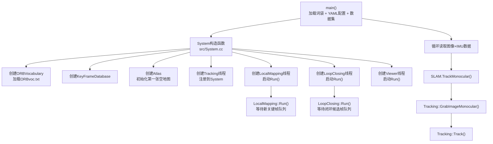
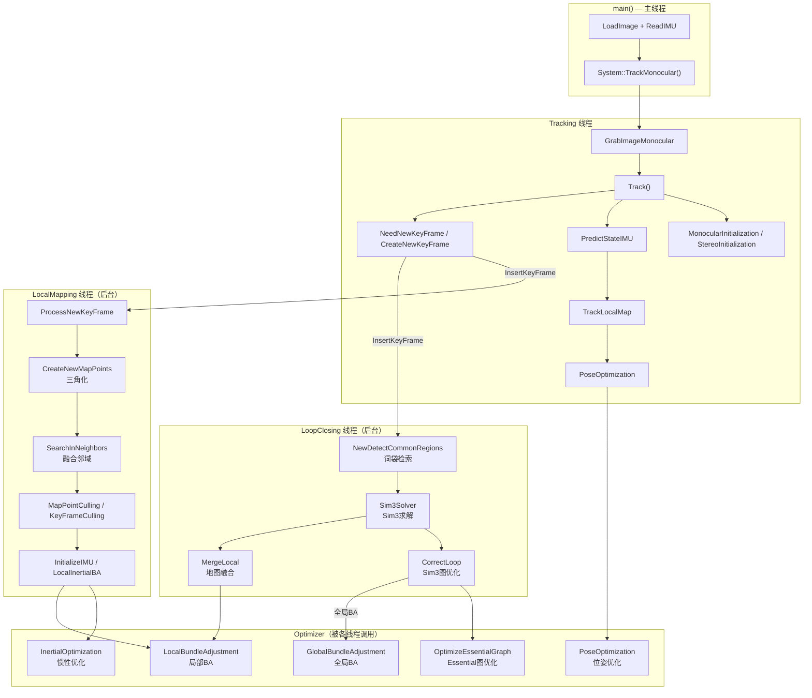

# ORB-SLAM3 超详细注释版 — 深度分析报告

> **项目名称：** ORB-SLAM3_detailed_comments
> **GitHub地址：** https://github.com/electech6/ORB_SLAM3_detailed_comments.git
> **项目定位：** 视觉SLAM / 视觉-惯性SLAM / 多地图SLAM
> **主要语言：** C++
> **依赖框架：** OpenCV (>=3.0)、Eigen3 (>=3.1)、g2o、DBoW2、Pangolin、Sophus
> **Stars：** 1,459 | **Forks：** 479

---

## 一、代码架构与流程分析

### 1.1 项目整体架构

ORB-SLAM3_detailed_comments 是对原始 [UZ-SLAMLab/ORB_SLAM3](https://github.com/UZ-SLAMLab/ORB_SLAM3) 的中文全注解读写版本，核心目标是帮助学习者理解 ORB-SLAM3 的每一行源码。项目的代码结构与原始版完全一致，目录组织如下：

```
ORB_SLAM3_detailed_comments/
├── include/                          # 头文件目录（24个核心类）
│   ├── System.h                      # 系统入口，负责初始化所有线程
│   ├── Tracking.h                    # 跟踪线程
│   ├── LocalMapping.h                # 局部建图线程
│   ├── LoopClosing.h                 # 闭环检测线程
│   ├── Atlas.h                       # 多地图管理器（Atlas系统）
│   ├── Map.h                         # 单张地图
│   ├── KeyFrame.h                    # 关键帧
│   ├── MapPoint.h                    # 地图点
│   ├── Frame.h                       # 普通帧
│   ├── Optimizer.h                   # 优化器（BA、PoseGraph）
│   ├── ImuTypes.h                    # IMU数据类型与预积分
│   ├── ORBextractor.h               # ORB特征提取
│   ├── ORBmatcher.h                 # 特征匹配
│   ├── ORBVocabulary.h              # ORB词袋模型
│   ├── KeyFrameDatabase.h           # 关键帧数据库（词袋索引）
│   ├── Settings.h                   # YAML配置文件解析
│   ├── Converter.h                 # 数据类型转换工具
│   ├── GeometricCamera.h            # 相机基类
│   │   ├── Pinhole.h               # 针孔相机模型
│   │   └── KannalaBrandt8.h        # 鱼眼相机模型（Kannala-Brandt）
│   ├── G2oTypes.h                  # g2o图优化自定义顶点和边
│   ├── OptimizableTypes.h          # g2o可优化变量类型
│   ├── Sim3Solver.h                # Sim3求解器（闭环/融合时尺度）
│   ├── MLPnPsolver.h               # 参议院PnP求解器
│   ├── Initializer.h               # 单目初始化器
│   ├── TwoViewReconstruction.h    # 双视图重建
│   ├── PnPsolver.h                # PnP求解器
│   ├── GeometricTools.h           # 几何工具
│   ├── FrameDrawer.h              # 帧可视化绘制
│   ├── MapDrawer.h                # 地图可视化绘制
│   ├── Viewer.h                    # Pangolin可视化界面
│   └── Config.h                   # 全局配置
├── src/                             # 源文件目录（27个核心文件，与include一一对应）
├── Thirdparty/                      # 第三方库（已包含在项目中）
│   ├── DBoW2/                      # 词袋模型（用于地点识别）
│   ├── g2o/                        # 图优化库
│   └── Sophus/                     # 李代数库（SE3/Sim3）
├── Examples/                        # 示例程序
│   ├── Monocular/                  # 单目示例（EuRoC、KITTI、TUM、RealSense）
│   ├── Monocular-Inertial/         # 单目+IMU示例（IMU预积分）
│   ├── Stereo/                     # 双目示例
│   ├── Stereo-Inertial/            # 双目+IMU示例
│   ├── RGB-D/                      # RGB-D示例（TUM数据集）
│   ├── RGB-D-Inertial/            # RGB-D+IMU示例
│   ├── ROS/                       # ROS接口节点
│   └── Calibration/                # 相机标定工具
├── CMakeLists.txt                  # CMake构建配置
├── build.sh                         # 一键编译脚本
└── Calibration_Tutorial.pdf         # 标定教程文档
```

#### 核心模块职责与依赖关系

| 模块 | 职责 | 依赖 | 所在文件 |
|------|------|------|---------|
| **System** | 初始化所有线程，管理全局状态 | Tracking, LocalMapping, LoopClosing, Atlas | `src/System.cc` |
| **Tracking** | 实时位姿估计 + 关键帧决策 | Frame, ORBextractor, ORBmatcher, MapPoint, KeyFrame | `src/Tracking.cc` |
| **LocalMapping** | 局部地图管理 + Local BA + IMU初始化 | MapPoint, KeyFrame, Optimizer | `src/LocalMapping.cc` |
| **LoopClosing** | 闭环检测 + Sim3优化 + Global BA | KeyFrameDatabase, ORBVocabulary, Optimizer | `src/LoopClosing.cc` |
| **Atlas** | 多地图管理（支持地图融合） | Map, KeyFrame, MapPoint | `src/Atlas.cc` |
| **Optimizer** | BA（光束法平差）、PoseGraph优化 | g2o | `src/Optimizer.cc` |
| **ImuTypes** | IMU预积分、噪声建模、李代数雅可比 | Sophus, Eigen | `src/ImuTypes.cc` |

### 1.2 核心算法流程

#### 主入口函数及启动流程

以单目-惯性EuRoC数据集为例（`Examples/Monocular-Inertial/mono_inertial_euroc.cc`），程序启动流程如下：



#### 系统初始化流程（System构造函数）

`src/System.cc` 构造函数流程：

```cpp
// src/System.cc ~line 200
System::System(const string &strVocFile, const string &strSettingsFile,
                const eSensor sensor, const bool bUseViewer, ...) {
    // 1. 加载ORB词袋
    mpVocabulary = new ORBVocabulary();
    mpVocabulary->loadFromTextFile(strVocFile);  // ~9MB词袋文件

    // 2. 创建关键帧数据库（词袋索引）
    mpKeyFrameDatabase = new KeyFrameDatabase(*mpVocabulary);

    // 3. 创建Atlas（多地图管理器）
    mpAtlas = new Atlas();

    // 4. 创建Tracking
    mpTracker = new Tracking(this, mpVocabulary, ..., sensor);

    // 5. 创建LocalMapping（纯视觉或视觉惯性模式）
    mpLocalMapper = new LocalMapping(mpAtlas, bMonocular, bInertial);

    // 6. 创建LoopClosing
    mpLoopCloser = new LoopClosing(mpAtlas, mpKeyFrameDatabase,
                                    mpVocabulary, bFixScale, bActiveLC);

    // 7. 创建Viewer（可选）
    mpViewer = new Viewer(this, ...);
    mpMapDrawer = new MapDrawer(...);

    // 8. 启动线程
    mptLocalMapping = new thread(&LocalMapping::Run, mpLocalMapper);
    mptLoopClosing = new thread(&LoopClosing::Run, mpLoopCloser);
    if (bUseViewer)
        mptViewer = new thread(&Viewer::Run, mpViewer);
}
```

#### 跟踪线程核心流程（Tracking::Track）

`src/Tracking.cc` 中的 `Track()` 是核心：

```cpp
// src/Tracking.cc ~line 700
void Tracking::Track() {
    // 1. 检查IMU预积分是否完成
    if (bImuPreintegrated) {
        PredictStateIMU();  // IMU预测位姿
    }

    // 2. 根据跟踪状态分发处理
    switch (mState) {
    case NO_IMAGES_YET:
        // 第一帧，等待初始化
        break;
    case NOT_INITIALIZED:
        MonocularInitialization();     // 单目初始化（对极几何）
        CreateInitialMapMonocular();   // 三角化初始地图
        break;
    case OK:
        // 3. 跟踪策略（按优先级尝试）
        if (mbOnlyTracking) {
            // 纯定位模式：仅跟踪，不建图
        } else {
            if (bIMU_USED) {
                // 惯性模式：用IMU预测 + 地图点匹配
                PredictStateIMU();
                bool bOK = TrackLocalMap();  // 核心：匹配局部地图
                if (!bOK) {
                    // IMU失效，走纯视觉
                }
            } else {
                // 纯视觉模式
                bool bOK = TrackWithMotionModel();  // 运动模型跟踪
                if (!bOK) bOK = TrackReferenceKeyFrame(); // 参考关键帧跟踪
                if (!bOK) Relocalization();           // 重定位
            }
        }
        break;
    case RECENTLY_LOST:
    case LOST:
        Relocalization();  // 丢失后重定位
        break;
    }

    // 4. 判断是否需要插入新关键帧
    if (NeedNewKeyFrame())
        CreateNewKeyFrame();

    // 5. 更新运动模型
    mVelocity = mCurrentFrame.GetPose() * mLastFrame.GetPose().inverse();
}
```

#### 局部建图线程流程（LocalMapping::Run）

```cpp
// src/LocalMapping.cc ~line 100
void LocalMapping::Run() {
    while (CheckFinish()) {
        // 1. 检查新关键帧队列
        if (CheckNewKeyFrames()) {
            ProcessNewKeyFrame();      // 处理新关键帧
            CreateNewMapPoints();       // 三角化生成新地图点
            MapPointCulling();          // 剔除坏地图点
            SearchInNeighbors();        // 融合邻域关键帧的地图点
            KeyFrameCulling();          // 剔除冗余关键帧

            // 2. 执行局部BA
            if (mbInertial) {
                // IMU初始化与优化
                if (bInitializing) InitializeIMU();  // IMU零偏/尺度估计
                else LocalInertialBA();              // 惯性BA
            } else {
                LocalBundleAdjustment();               // 纯视觉BA
            }
        }
    }
}
```

#### 闭环检测线程流程（LoopClosing::Run）

```cpp
// src/LoopClosing.cc ~line 200
void LoopClosing::Run() {
    while (CheckFinish()) {
        if (CheckNewKeyFrames()) {
            // 1. 地点识别（词袋匹配）
            NewDetectCommonRegions();
            // 2. 如果检测到闭环/融合
            if (mbLoopDetected) CorrectLoop();      // 闭环校正
            if (mbMergeDetected) MergeLocal();      // 地图融合
        }
    }
}
```

### 1.3 多线程同步机制

ORB-SLAM3 使用标准 C++ `std::thread` 和 `std::mutex` 管理线程间通信：

| 通信方式 | 使用场景 |
|---------|---------|
| **锁 + 队列** | Tracking → LocalMapping：新关键帧通过 `mlNewKeyFrames` 队列传递，`std::mutex` 保护 |
| **条件变量** | `mlNewKeyFrames.empty()` 条件等待新关键帧 |
| **原子标志** | `mbReset`、`mbShutDown`、`mbActivateLocalizationMode` 等状态标志 |
| **指针传递** | Tracking 持有 LocalMapping/LoopClosing 指针，可主动请求停止 |

关键同步代码示例（`src/LocalMapping.cc`）：

```cpp
// src/LocalMapping.cc ~line 300
void LocalMapping::InsertKeyFrame(KeyFrame* pKF) {
    unique_lock<mutex> lock(mMutexNewKFs);
    mlNewKeyFrames.push_back(pKF);
}

// LocalMapping线程中
void LocalMapping::Run() {
    while (1) {
        {
            unique_lock<mutex> lock(mMutexNewKFs);
            // 等待新关键帧
        }
        // 处理关键帧...
    }
}
```

### 1.4 数据结构设计

#### 核心数据结构

**Frame（帧）** `include/Frame.h`：
- 包含ORB特征点（`mvKeys`, `mvKeysUn`）、描述子（`mDescriptors`）
- 词袋向量（`mBowVec`, `mFeatVec`）用于快速匹配
- 关联的地图点（`mvpMapPoints`）
- 相机内参（`mK`）、畸变系数（`mDistCoef`）
- IMU预积分数据（`mpImuPreintegrated`）
- 支持鱼眼相机双目（`mvKeysRight`, `Nleft`/`Nright`）

**KeyFrame（关键帧）** `include/KeyFrame.h`：
- 共视图连接（`mConnectedKeyFrameWeights`）
- 生成树父子关系（`mpParent`, `mspChildrens`）
- 闭环边（`mspLoopEdges`）和融合边（`mspMergeEdges`）
- 预积分IMU数据（`mpImuPreintegrated`）

**MapPoint（地图点）** `include/MapPoint.h`：
- 世界坐标（`mWorldPos`）
- 观测该点的关键帧列表（`mObservations`）
- 最佳描述子（`mDescriptor`）用于匹配
- 距离尺度不变区间（`mfMinDistance`, `mfMaxDistance`）

**Atlas（多地图）** `include/Atlas.h`：
- 管理 `std::set<Map*>` 多张地图
- 支持地图融合：当检测到与历史地图匹配时，将两张地图合并
- 支持IMU初始化状态跟踪

**ImuTypes::Preintegrated（IMU预积分）** `include/ImuTypes.h`：
```cpp
// src/ImuTypes.cc ~line 300
class Preintegrated {
    // 预积分增量（相对于前一关键帧）
    Eigen::Matrix3f dR;    // 旋转增量
    Eigen::Vector3f dV;   // 速度增量
    Eigen::Vector3f dP;   // 位置增量
    float dT;             // 时间间隔

    // 雅可比矩阵（用于偏置更新）
    Eigen::Matrix3f JRg, JVg, JVa, JPg, JPa;

    // 噪声协方差
    Eigen::DiagonalMatrix Nga, NgaWalk;
};
```

#### 配置文件结构（YAML）

`Examples/Monocular-Inertial/EuRoC.yaml` 结构示例：

```yaml
# Camera类型与内参
Camera.type: "PinHole"
Camera.fx: 458.654
Camera.fy: 457.296
Camera.cx: 367.215
Camera.cy: 248.375
Camera.k1: -0.28340811
Camera.k2: 0.07395907
Camera.p1: 0.00019359
Camera.p2: 1.76187114e-05

# IMU参数
IMU.NoiseGyro: 1.0e-5
IMU.NoiseAcc: 1.0e-4
IMU.GyroWalk: 1.0e-7
IMU.AccWalk: 1.0e-6
IMU.Frequency: 200
Tbc: [0.0148655429788, -0.999880929698, 0.00414029679424,
      0.999950246656, 0.0149672131247, 0.00770942131476,
      -0.00771019952492, -0.00492458634603, -0.999966707312]

# ORB特征参数
ORB.nFeatures: 1000
ORB.scaleFactor: 1.2
ORB.nLevels: 8
```

### 1.5 核心函数调用关系全流程

以下梳理从程序启动到各线程完整执行的主调用链，帮助从宏观视角理解系统运转全貌。

#### 1.5.1 单目惯性模式主流程（EuRoC 数据集）

```
main() [Examples/Monocular-Inertial/mono_inertial_euroc.cc]
│
├─ 1. 数据加载阶段
│   ├─ LoadImage()          加载左目图像
│   ├─ imuReader.ReadIMU()  读取IMU数据（时间戳+加速度+角速度）
│   └─ 等待首个IMU数据就绪
│
└─ 2. SLAM主循环（每帧迭代）
    │
    └─> System::TrackMonocular() [src/System.cc]
        │
        └─> Tracking::GrabImageMonocular() [src/Tracking.cc]
            │
            ├─> Tracking::Track()  ★ 跟踪主函数
            │   │
            │   ├─ 【初始化阶段 — 状态: NOT_INITIALIZED】
            │   │   ├─ MonocularInitialization()
            │   │   │   ├─ ORBextractor::operator()          提取ORB特征
            │   │   │   ├─ Initializer::Initialize()        对极几何求解F矩阵
            │   │   │   └─ Initializer::ReconstructH() / ReconstructF()  三角化恢复结构
            │   │   │
            │   │   └─ CreateInitialMapMonocular()
            │   │       ├─ KeyFrame::KeyFrame()              创建初始关键帧
            │   │       ├─ MapPoint::AddObservation()        关联地图点与关键帧
            │   │       ├─ MapPoint::ComputeDistinctiveDescriptors()
            │   │       ├─ Map::AddKeyFrame()               地图注册关键帧
            │   │       ├─ Optimizer::GlobalBundleAdjustemt()  全局BA优化初始地图
            │   │       └─ [激活LocalMapping线程 / LoopClosing线程]
            │   │           ├─> LocalMapping::Run() → ProcessNewKeyFrame() → CreateNewMapPoints()
            │   │           └─> LoopClosing::Run() → NewDetectCommonRegions()
            │   │
            │   ├─ 【惯性模式 — 状态: OK, IMU可用】
            │   │   ├─ PredictStateIMU()                    IMU积分预测当前帧位姿
            │   │   │   └─ Preintegrated::IntegrationPreviousStep()
            │   │   │
            │   │   ├─ TrackLocalMap()                      局部地图跟踪（核心匹配）
            │   │   │   ├─ ORBmatcher::SearchByProjection() 投影匹配搜索地图点
            │   │   │   ├─ MapPoint::GetWorldPos()          获取世界坐标
            │   │   │   ├─ Frame::isInFrustum()             判断地图点是否在当前帧视野
            │   │   │   └─ Optimizer::PoseOptimization()     Pose优化（固定地图点优化位姿）
            │   │   │
            │   │   ├─ [若IMU失效] TrackWithMotionModel()   降级：纯视觉运动模型跟踪
            │   │   │   ├─ mVelocity * mLastFrame.GetPose()  运动模型预测
            │   │   │   └─ ORBmatcher::SearchByProjection()
            │   │   │
            │   │   └─ [若仍失败] TrackReferenceKeyFrame()  参考关键帧匹配
            │   │       └─ ORBmatcher::SearchByBow()        词袋加速匹配
            │   │
            │   ├─ 【纯视觉模式 — 状态: OK, 无IMU】
            │   │   ├─ TrackWithMotionModel()               运动模型跟踪
            │   │   ├─ [失败] TrackReferenceKeyFrame()      参考关键帧跟踪
            │   │   ├─ [失败] Relocalization()              重定位（词袋检索 + PnP）
            │   │   │   ├─ KeyFrameDatabase::DetectRelocalizationCandidates()
            │   │   │   │   └─ ORBVocabulary::transform()   词袋向量计算
            │   │   │   ├─ ORBmatcher::SearchByBow()        候选帧特征匹配
            │   │   │   └─ PnPsolver::iterate()             PnP求解（RANSAC）
            │   │   │
            │   │   └─ Tracking::TrackLocalMap()            局部地图匹配
            │   │
            │   ├─ 【丢失状态 — 状态: RECENTLY_LOST / LOST】
            │   │   ├─ PredictStateIMU()                    IMU预测维持跟踪
            │   │   └─ Relocalization()                    尝试重定位
            │   │
            │   ├─ 【关键帧决策与插入】
            │   │   ├─ NeedNewKeyFrame()                    判断是否需要新关键帧
            │   │   │   ├─ 共视关键帧数、跟踪地图点比例、距上次关键帧时间等
            │   │   │   └─ [需新关键帧] CreateNewKeyFrame()
            │   │   │       ├─ KeyFrame::KeyFrame()         构造新关键帧
            │   │   │       ├─ Tracking::UpdateLastFrame()   更新上一帧位姿
            │   │   │       ├─ Tracking::SearchReferencePointsInFrustum() 搜索可共点
            │   │   │       ├─ KeyFrame::ComputeBoW()        计算词袋向量
            │   │   │       ├─ Map::AddKeyFrame()           加入地图
            │   │   │       └─> LocalMapping::InsertKeyFrame()  插入建图队列
            │   │   │           └─ [唤醒LocalMapping线程]
            │   │   │
            │   └─ 【运动模型更新】
            │       └─ mVelocity = mCurrentFrame.GetPose() * mLastFrame.GetPose().inverse()
            │
            └─> System::mState = mTrackingState  记录跟踪状态（供外部查询）

    ├─> LocalMapping::Run()  【后台建图线程，并行执行】
    │   while (true) {
    │       ├─ CheckNewKeyFrames()              检查新关键帧队列
    │       ├─ ProcessNewKeyFrame()             处理新关键帧
    │       │   ├─ MapPoint::UpdateNormalAndDepth()  更新法向量和观测距离
    │       │   ├─ MapPoint::ComputeDistinctiveDescriptors()  计算最优描述子
    │       │   └─ KeyFrame::UpdateConnections()     更新共视图连接
    │       │       └─ [生成树/共视图边权重统计]
    │       │
    │       ├─ CreateNewMapPoints()             三角化生成新地图点
    │       │   ├─ ORBmatcher::SearchByBow()   词袋匹配候选点
    │       │   ├─ Initializer::Triangulate()   三角化求解3D坐标
    │       │   └─ MapPoint::AddObservation()    关联地图点与关键帧
    │       │
    │       ├─ MapPointCulling()                剔除坏地图点（观测少/深度无效）
    │       │
    │       ├─ SearchInNeighbors()              融合邻域关键帧的地图点
    │       │   └─ ORBmatcher::SearchByProjection()
    │       │
    │       ├─ KeyFrameCulling()                剔除冗余关键帧
    │       │   └─ Map::EraseKeyFrame()
    │       │
    │       └─ IMU/BA优化阶段
    │           ├─ [初始化阶段] InitializeIMU()        IMU零偏/尺度初始化
    │           │   ├─ Optimizer::InertialOptimization()  纯惯性优化（重力方向Rwg、尺度scale）
    │           │   ├─ ScaleRefinement()                尺度细化
    │           │   └─ [成功后] bInitializing = false
    │           │
    │           └─ [正常阶段] LocalInertialBA() / LocalBundleAdjustment()
    │               ├─ Optimizer::LocalBundleAdjustment()  局部BA（关键帧+地图点联合优化）
    │               └─ Optimizer::LocalInertialBA()        惯性BA（加入IMU残差）
    │   }
    │
    └─> LoopClosing::Run()  【后台闭环线程，并行执行】
        while (true) {
            ├─ CheckNewKeyFrames()              检查新关键帧队列
            ├─ NewDetectCommonRegions()          闭环/融合检测
            │   ├─ KeyFrameDatabase::DetectLoopCandidates()   词袋检索候选帧
            │   │   └─ ORBVocabulary::match()    词袋向量相似度匹配
            │   ├─ [候选帧存在] DetectAndReffineSim3FromLastKF()
            │   │   ├─ Sim3Solver::Compute()     Sim3求解（旋转+平移+尺度）
            │   │   ├─ ORBmatcher::SearchByProjection() 投影匹配验证
            │   │   └─ Sim3Solver::Refine()      Sim3精细化
            │   ├─ [回环] mbLoopDetected = true
            │   └─ [融合] mbMergeDetected = true
            │
            ├─ [mbLoopDetected] CorrectLoop()   闭环校正
            │   ├─ LoopClosing::CorrectLoop()
            │   │   ├─ Optimizer::OptimizeEssentialGraph()  Sim3图优化
            │   │   ├─ MapPoint::Replace()       地图点融合（去除重复）
            │   │   ├─ KeyFrame::AddLoopEdge()   添加闭环边
            │   │   ├─ Map::CommitPostLoopClosure()
            │   │   └─ [异步] Optimizer::GlobalBundleAdjustment()  全局BA
            │   │
            └─ [mbMergeDetected] MergeLocal()  地图融合
                ├─ LoopClosing::MergeLocal()
                │   ├─ FindMajorConnection()    寻找待融合地图的主连接
                │   ├─ GeometricTransformationForMerge()  坐标变换对齐
                │   ├─ SearchConnectedByMP()    搜索可融合的地图点/关键帧
                │   ├─ Optimizer::LocalBundleAdjustment() Welding BA
                │   └─ Atlas::MergeMaps()       Atlas合并两张地图
        }
```

#### 1.5.2 双目/RGB-D 模式主流程

```
main()
└─> System::TrackStereo() / TrackRGBD()
    └─> Tracking::GrabImageStereo() / GrabImageRGBD()
        ├─ ORBextractor::operator()          双目同时提取ORB特征
        ├─ [RGB-D] ComputeRobustDepth()      根据深度图过滤无效特征点
        ├─ ComputeStereoMatches()             双目匹配计算特征点深度
        │   └─ ORBmatcher::ComputeStereoMatches()
        └─ Tracking::Track()
            ├─ [初始化] StereoInitialization()  双目初始化（无需对极几何，直接三角化）
            ├─ [OK] TrackLocalMap()              局部地图跟踪
            └─ [Lost] Relocalization()
```

#### 1.5.3 系统退出与清理流程

```
main() → System::Shutdown()
├─> Tracking::RequestStop()
│   └─ mbShutdown = true
├─> LocalMapping::RequestStop()
│   └─ mbStopRequested = true → mbStop = true
├─> LoopClosing::RequestStop()
│   └─ mbStopRequested = true → mbStop = true
├─> Viewer::RequestStop()
│   └─ mbStopped = true
│
├─ [等待线程结束]
│   ├─ mptLocalMapping->join()
│   ├─ mptLoopClosing->join()
│   └─ mptViewer->join()
│
├─> Atlas::Serialize()  【可选】地图序列化保存
└─ 释放所有指针资源（mpVocabulary, mpKeyFrameDatabase, mpAtlas...）
```

#### 1.5.4 关键函数调用关系图（Mermaid）



---

## 二、技术亮点与创新点

### 2.1 算法创新

#### 1. 多地图系统（Atlas）

ORB-SLAM3 引入 Atlas 系统管理多张独立地图，是 IMU 初始化失败或跟踪丢失时创建新地图段的关键。相关论文为 **ORBSLAM-Atlas**（IROS 2019）。代码核心在 `src/Atlas.cc`：

```cpp
// src/Atlas.cc
void Atlas::CreateNewMap() {
    mpCurrentMap = new Map();    // 创建全新空地图
    mspMaps.insert(mpCurrentMap);
    mnLastInitKFidMap = 0;
}
```

当跟踪丢失（LOST状态）且 `mInsertKFsWhenLost=true` 时，系统会在当前地图之外新建一段地图，后续通过回环检测进行地图融合。

#### 2. 视觉-惯性融合（IMU Initialization）

ORB-SLAM3 的 IMU 初始化采用 **纯惯性优化 + 视觉结构恢复** 两步法（ICRA 2020 论文 "Inertial-Only Optimization for Visual-Inertial Initialization"）：

```cpp
// src/LocalMapping.cc ~line 500
void LocalMapping::InitializeIMU(float priorG, float priorA, bool bFirst) {
    // 第一阶段：纯惯性优化
    // 估计重力方向 Rwg、尺度 scale、IMU零偏 bg/ba
    Optimizer::InertialOptimization(pMap, Rwg, scale, bg, ba,
                                    bMono, covInertial, ...);
    // 第二阶段：地图尺度对齐
    ScaleRefinement();
}
```

IMU预积分核心在 `src/ImuTypes.cc`，采用中点积分法：

```cpp
// src/ImuTypes.cc ~line 200
void Preintegrated::IntegrateNewMeasurement(...) {
    // 增量旋转（通过右雅可比修正）
    deltaR = deltaR * Sophus::SO3f::exp(
        (w - b.w) * dt + 0.5 * Jr * (w - b.w).cross(deltaR) * dt
    );
    // 增量速度和位置
    deltaV += deltaR * (a - b.a) * dt;
    deltaP += deltaV * dt + 0.5 * deltaR * (a - b.a) * dt * dt;
}
```

#### 3. 相机模型支持

支持 **针孔（Pinhole）** 和 **鱼眼（Kannala-Brandt）** 两种相机模型，通过 `GeometricCamera` 基类抽象：

```cpp
// include/CameraModels/GeometricCamera.h
class GeometricCamera {
    virtual cv::Point2f project(...) = 0;
    virtual Eigen::Vector3f unproject(...) = 0;
    virtual bool isInFrustum(...) = 0;
};

// include/CameraModels/KannalaBrandt8.h
class KannalaBrandt8 : public GeometricCamera {
    // 鱼眼相机投影模型，支持 wide-FOV 镜头
};
```

#### 4. Sim3 闭环校正

单目SLAM存在尺度漂移，闭环时使用 Sim3（7DoF，旋转+平移+尺度）进行校正，支持闭环和地图融合两种情况：

```cpp
// src/LoopClosing.cc ~line 300
// 闭环：优化 EssentialGraph（Sim3）
Optimizer::OptimizeEssentialGraph(pLoopKF, pCurKF,
    NonCorrectedSim3, CorrectedSim3, LoopConnections, bFixScale);

// 地图融合：合并两张地图的坐标
void LoopClosing::MergeLocal() {
    // Sim3融合 + Welding BA
    Optimizer::LocalBundleAdjustment(...);
}
```

### 2.2 工程实践亮点

#### 1. 词袋模型加速特征匹配

DBoW2 库将 ORB 描述子量化为词袋向量，实现 O(1) 关键帧检索。地点识别流程：

```cpp
// src/LoopClosing.cc ~line 500
bool LoopClosing::NewDetectCommonRegions() {
    // 1. 从共视关键帧中挑选候选
    vector<KeyFrame*> vpCandidateKFs = mpCurrentKF->GetBestCovisibilityKeyFrames(20);
    // 2. 词袋匹配（仅比较词汇）
    int nMatches = mpORBVocabulary->match(BowVec1, BowVec2);
    // 3. Sim3求解 + 投影匹配验证
    DetectAndReffineSim3FromLastKF(...);
}
```

#### 2. 网格划分加速投影匹配

Frame 将图像划分为 48×64 的网格（`FRAME_GRID_ROWS=48`, `FRAME_GRID_COLS=64`），搜索地图点时仅在对应格子内查找特征点：

```cpp
// include/Frame.h
vector< vector<MapPoint*> > > mGrid;  // [FRAME_GRID_COLS][FRAME_GRID_ROWS]

// src/Tracking.cc ~line 900
vector<int> Frame::GetFeaturesInArea(float x, float y, float r) {
    // 通过网格坐标计算，仅遍历局部格子
}
```

#### 3. 鲁棒性设计

- **跟踪丢失保护**：LOST状态时尝试重定位（词袋检索 + PnP求解）
- **IMU失效降级**：惯性传感器失效时自动退化为纯视觉跟踪模式
- **地图点融合**：重复观测的地图点通过 `ReplaceMapPointMatch` 合并

### 2.3 可借鉴之处

| 方面 | 借鉴点 |
|------|--------|
| **多线程架构** | 生产者-消费者队列模式、状态标志机 |
| **配置管理** | `Settings` 类统一解析YAML，避免硬编码 |
| **序列化** | Boost序列化支持地图保存/加载 |
| **相机抽象** | 基类+派生类支持多种传感器模型 |
| **时间测量** | `REGISTER_TIMES` 宏开关统计各模块耗时 |

---

## 三、面试问题整理（社招方向）

### 基础概念类（校招/初级）

**1. ORB-SLAM3支持哪些传感器配置？各有什么区别？**
> 参考答案要点：
> - 单目（MONOCULAR）：无尺度信息，需要运动初始化（如对极几何），最简单
> - 双目（STEREO）：基线提供尺度，通过视差三角化直接获得深度
> - RGB-D（RGBD）：深度图直接提供深度，无需三角化，但受深度传感器范围限制
> - 单目+IMU（IMU_MONOCULAR）：IMU提供尺度参考，收敛更快
> - 双目+IMU（IMU_STEREO）/ RGB-D+IMU（IMU_RGBD）：最鲁棒的配置
> - 代码中通过 `System::eSensor` 枚举区分，`Tracking` 根据传感器类型选择不同的初始化和跟踪策略

**2. 什么是IMU预积分？为什么需要预积分？**
> 参考答案要点：
> - 预积分将连续的IMU测量（加速度+角速度）在两帧之间累积，得到相对运动
> - 核心问题：若每帧位姿变化就需要重新线性化IMU积分，计算量巨大
> - 解决：预积分计算相对于「参考关键帧」的增量（dR, dV, dP），偏置变化时通过雅可比矩阵修正，无需重积分
> - `src/ImuTypes.cc` 中的 `Preintegrated` 类实现，积分方法为中点法

**3. 共视图（Covisibility Graph）和生成树（Spanning Tree）的区别？**
> 参考答案要点：
> - 共视图：边权重 = 两关键帧共同观测的地图点数量，用于选择局部地图
> - 生成树：每个关键帧只有一个父节点（与其共视最多的关键帧），用于回环边的传播
> - 代码中 `KeyFrame::UpdateConnections()` 构建共视图，`LoopClosing` 在闭环时通过生成树传播Sim3校正

**4. 为什么单目SLAM需要初始化？双目和RGB-D不需要？**
> 参考答案要点：
> - 单目：尺度不确定性——无法从单张2D图像恢复3D尺度，需要通过两视图对极几何求解
> - 初始化后通过三角化获得初始地图点尺度，后续通过IMU/运动/深度传感器提供尺度
> - 双目/深度：深度图/视差直接提供米级深度信息，无需初始化步骤

### 工程实践类（社招/中级）

**1. Local BA（局部光束法平差）和 Pose Optimization（位姿优化）的区别？何时调用？**
> 参考答案要点：
> - **局部BA**（`Optimizer::LocalBundleAdjustment`）：优化局部窗口内的关键帧位姿 + 地图点坐标，包括共视图中的关键帧（通常20个），海塞矩阵规模大，精度高
> - **Pose优化**（`Optimizer::PoseOptimization`）：固定地图点，仅优化当前帧的6DoF位姿，用于Tracking线程中快速跟踪（如 `Tracking::TrackLocalMap` 之后），速度快
> - 实际项目中的权衡：实时性要求高时用Pose优化，建图精度要求高时用BA

**2. IMU初始化失败会有什么后果？系统如何处理？**
> 参考答案要点：
> - 若前几个关键帧IMU数据不足/噪声过大，初始化失败会导致尺度、重力方向估计不准
> - ORB-SLAM3的处理：初始化失败则纯视觉模式运行（`bInitializing=false`），自动降级
> - 代码 `LocalMapping::InitializeIMU` 中有 `mbBadImu` 标志判断

**3. 闭环检测的核心步骤是什么？为什么要用Sim3而不是SE3？**
> 参考答案要点：
> - 步骤：①词袋匹配候选帧 → ②Sim3求解验证几何一致性 → ③投影匹配更多地图点 → ④EssentialGraph优化 → ⑤全局BA
> - 单目SLAM存在尺度漂移，仅用SE3无法建模尺度误差；Sim3的尺度自由度修正累积漂移
> - 双目/RGB-D模式则用SE3（尺度已知），`bFixScale=true`

**4. 共视图边权重如何计算？权重阈值如何选取？**
> 参考答案要点：
> - 权重 = 两关键帧共同观测的**良好地图点**数量（`mnMinimumKeyFrames` 以上）
> - `KeyFrame::UpdateConnections()` 中遍历所有地图点，统计共视关键帧
> - 阈值选取：`ORBmatcher.cc` 中默认阈值15，过高会丢失连接，过低会产生过多边

**5. 在实际部署中遇到过什么坑？**
> 参考答案要点：
> - **IMU标定不准**：外参 Tbc 误差会导致预积分发散，需要精确标定IMU与相机之间的外参和零偏
> - **初始化条件**：单目+IMU需要在慢速运动中初始化，快速运动会导致IMU积分爆炸
> - **实时性**：BA计算量大，跟踪线程耗时过长时需要降级策略（如减少特征点数量）

### 架构设计类（高级/架构师）

**1. 如果将ORB-SLAM3扩展到大规模城市SLAM，你会怎么设计？**
> 参考答案要点：
> - 当前系统的瓶颈：全局BA在大规模场景中不可行；共视图会过于稠密
> - 改进方向：
>   - **分层地图**：子地图级别（类似OctoMap/LVIO的分层方案），先在子图内局部优化，再全局优化子图位姿
>   - **持续定位**：Atlas中旧地图标记为只读，新序列只在新地图上运行，避免旧地图重优化
>   - **位姿图层级**：城市级别用_pose graph_而非BA，边的约束来自GPS/闭环
>   - **分布式**：多机器人协作SLAM，每机器人独立建图，通过共享词袋和全局关键帧数据库实现地图融合

**2. ORB-SLAM3与其他VIO系统（如VINS-Mono）相比，架构差异在哪里？**
> 参考答案要点：
> - **优化框架**：ORB-SLAM3用g2o做图优化；VINS-Mono用Ceres+滑动窗口优化
> - **IMU处理**：ORB-SLAM3在LocalMapping线程做IMU初始化（离线的两阶段）；VINS-Mono是在线滑动窗口紧耦合
> - **地图管理**：ORB-SLAM3有Atlas多地图系统；VINS-Mono是单地图
> - **回环**：ORB-SLAM3有词袋+Sim3闭环；VINS-Mono使用重检测+pose graph优化
> - **精度/鲁棒性权衡**：ORB-SLAM3在纹理丰富环境精度高；VINS-Mono在IMU高频场景更鲁棒

**3. 有哪些替代方案可以实现相同功能？各自的优劣？**
> 参考答案要点：
> - **替代方案1：LIO-SAM**（基于因子图的激光+视觉+IMU紧耦合）
>   - 优势：室外大场景精度高，对纹理要求低
>   - 劣势：依赖激光雷达，IMU+视觉仅用于里程计补全
> - **替代方案2：Cartographer**（Google室内外SLAM）
>   - 优势：实时性强，支持多传感器融合，有完善工程化
>   - 劣势：精度不如ORB-SLAM3，无完整地图管理
> - **替代方案3：OpenVSLAM**
>   - 优势：支持多种相机模型（Perspective、Fisheye、Equirectangular）
>   - 劣势：社区和精度不如ORB-SLAM3

### 手撕代码类

**1. 实现一个简单的PnP求解（仅描述思路）**

```cpp
// 思路：EPnP算法的核心步骤
// 1. 选择4个控制点（c1,c2,c3,c4），将3D点用控制点线性表示
// 2. 将相机投影方程写成 M * [alpha] = 0 的形式
// 3. SVD分解求零空间，取前4个奇异向量张成零空间
// 4. 对每个候选位姿，用RANSAC迭代求解
// 5. 选内点最多的解，用高斯牛顿优化重投影误差
```

**2. 实现IMU预积分的旋转更新（简化版）**

```cpp
// 伪代码：基于李代数的IMU旋转预积分
void Integrate(const Vector3f& w, const Vector3f& a, float dt) {
    Vector3f theta = (w - bias_gyro) * dt;           // 小角度近似
    Matrix3f deltaR = Exp_SO3(theta);                 // SO3指数映射

    // 右雅可比修正（考虑曲率）
    Matrix3f Jr = Matrix3f::Identity();
    if (theta.norm() > 1e-5f) {
        Jr = Matrix3f::Identity()
           - (1 - cos(theta.norm())) / theta.norm() * SO3_Wedge(theta)
           + (theta.norm() - sin(theta.norm())) / theta.norm()
             * SO3_Wedge(theta) * SO3_Wedge(theta);
    }

    dR_ = dR_ * deltaR;                             // 累积旋转
    dV_ = dV_ + dR_ * (a - bias_accel) * dt;       // 累积速度
    dP_ = dP_ + dV_ * dt;                          // 累积位置
}
```

---

## 四、扩展知识图谱

### 4.1 前置知识

学习ORB-SLAM3_detailed_comments前需要掌握：

| 知识点 | 掌握程度 | 推荐资源 |
|--------|---------|---------|
| **C++11 多线程** | 熟练使用 `std::thread`、`std::mutex`、`std::condition_variable` | `include/System.h` 中线程创建模式 |
| **Eigen3 线性代数** | 矩阵运算、LU/SVD分解、四元数与旋转矩阵互转 | `include/ImuTypes.h`、`src/Converter.cc` |
| **Sophus 李代数** | `SE3::exp/log`、`Sim3` 及其雅可比矩阵 | `include/Frame.h` 相机位姿操作 |
| **g2o 图优化** | 顶点/边定义、`LM` 优化求解器 | `include/G2oTypes.h`、`src/Optimizer.cc` |
| **OpenCV 图像处理** | ORB特征提取、相机标定、双目匹配 | `src/ORBextractor.cc` |
| **相机模型** | 针孔模型内参、畸变校正、鱼眼模型 | `include/CameraModels/Pinhole.h` |
| **SLAM基础** | 对极几何、三角化、PnP、BA | 十四讲相关章节 |
| **IMU测量模型** | 加速度/角速度测量、噪声建模、预积分 | `include/ImuTypes.h` |

### 4.2 关联项目

| 项目 | 关系 | GitHub |
|------|------|--------|
| **UZ-SLAMLab/ORB_SLAM3** | 原始仓库（非注释版） | https://github.com/UZ-SLAMLab/ORB_SLAM3 |
| **ORB-SLAM2** | ORB-SLAM3前身，不含IMU和多地图 | https://github.com/raulmur/ORB_SLAM2 |
| **VINS-Mono** | 另一个主流VIO系统，紧耦合滑动窗口 | https://github.com/HKUST-Aerial-Robotics/VINS-Mono |
| **LIO-SAM** | 激光+IMU紧耦合，因子图融合 | https://github.com/TixiaoShan/LIO-SAM |
| **OpenVSLAM** | 支持多种相机模型的通用视觉SLAM | https://github.com/xdspacelab/openvslam |
| **DBoW2** | 词袋模型库（第三方依赖） | https://github.com/dorian3d/DBoW2 |
| **g2o** | 图优化库（第三方依赖） | https://github.com/RainerKuemmerle/g2o |

### 4.3 延伸方向

基于ORB-SLAM3_detailed_comments可深入学习的方向：

**1. 视觉惯性紧耦合优化**
- 深入理解滑动窗口优化与批量BA的区别
- 学习ORB-SLAM3与VINS-Mono在IMU处理上的差异

**2. 多地图融合系统**
- Atlas系统如何管理多个独立的地图段
- Welding BA在地图融合中的作用

**3. 大规模SLAM工程化**
- 如何将ORB-SLAM3部署到机器人/无人机平台
- 与ROS的集成（`Examples/ROS/`）

**4. 自定义相机模型扩展**
- 在 `CameraModels/` 目录下添加新的相机模型（如catadioptric）
- 参考 `KannalaBrandt8` 的投影/反投影接口实现

**5. 性能优化**
- OpenCV多线程并行特征提取
- SIMD加速ORB描述子计算
- BA的稀疏性利用

---

## 五、核心文件速查表

| 功能 | 源文件 | 核心函数/类 |
|------|--------|------------|
| 系统入口/初始化 | `src/System.cc` | `System()`、`TrackMonocular()`、`Shutdown()` |
| 跟踪主循环 | `src/Tracking.cc` | `Track()`、`MonocularInitialization()`、`TrackLocalMap()` |
| ORB特征提取 | `src/ORBextractor.cc` | `operator()`、`ComputeKeyPointsOctTree()` |
| 特征匹配 | `src/ORBmatcher.cc` | `SearchByBoW()`、`SearchByProjection()` |
| 局部建图 | `src/LocalMapping.cc` | `Run()`、`ProcessNewKeyFrame()`、`InitializeIMU()` |
| 闭环检测 | `src/LoopClosing.cc` | `Run()`、`NewDetectCommonRegions()`、`CorrectLoop()` |
| 多地图管理 | `src/Atlas.cc` | `CreateNewMap()`、`GetCurrentMap()` |
| BA优化 | `src/Optimizer.cc` | `BundleAdjustment()`、`LocalBundleAdjustment()`、`PoseOptimization()` |
| IMU预积分 | `src/ImuTypes.cc` | `Preintegrated::IntegrateNewMeasurement()` |
| 地图点管理 | `src/MapPoint.cc` | `ComputeDistinctiveDescriptors()`、`UpdateNormalAndDepth()` |
| 关键帧管理 | `src/KeyFrame.cc` | `UpdateConnections()`、`ComputeBoW()` |
| 可视化 | `src/Viewer.cc` | `Run()` 负责Pangolin渲染 |

---

> **学习建议**：建议结合原论文 [ORB-SLAM3 (IEEE T-RO 2021)](https://arxiv.org/abs/2007.11898) 与 [IMU Initialization (ICRA 2020)](https://arxiv.org/pdf/2003.05766.pdf) 阅读注释版源码，从 `System` 构造函数开始，逐个模块深入理解。
