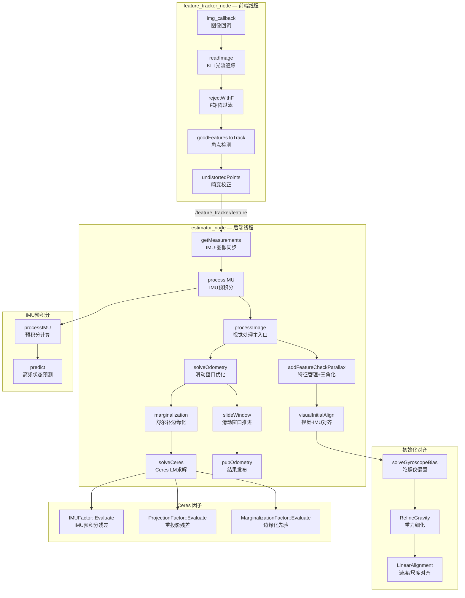

# VINS-Mono 超详细深度分析报告

> **项目名称：** VINS-Mono
> **GitHub地址：** https://github.com/HKUST-Aerial-Robotics/VINS-Mono
> **项目定位：** 单目视觉惯性紧耦合 SLAM（VIO）
> **主要语言：** C++
> **依赖框架：** ROS、PCL、Eigen3、Ceres Solver、DBoW2（回环检测）、OpenCV
> **Stars：** 5,500+ | **论文：** IEEE T-RO 2018

---

## 一、代码架构与流程分析

### 1.1 项目整体架构

VINS-Mono 是港科大空中机器人实验室（HKU-Aerial-Robotics）的经典 VIO 系统，核心贡献是 **IMU 预积分算法**，首次系统性地解决了单目视觉+IMU 紧耦合的初始化难题。系统由两个独立 ROS 节点组成：**特征追踪节点**（前端）和 **VIO 估计器节点**（后端），可选加 **位姿图节点**（全局优化）。

```
VINS-Mono/
├── feature_tracker/                   # 【前端】特征追踪节点
│   ├── src/
│   │   ├── feature_tracker_node.cpp  # ROS节点入口，图像回调
│   │   └── feature_tracker.cpp       # KLT光流追踪、F矩阵过滤、特征管理
│   ├── include/
│   │   └── feature_tracker.h
│   └── config/                       # 相机内参配置文件
├── vins_estimator/                   # 【后端】VIO估计器节点
│   ├── src/
│   │   ├── estimator_node.cpp         # ROS节点入口，IMU/图像同步
│   │   ├── estimator.cpp             # 滑动窗口优化主循环
│   │   ├── initial_alignment.cpp     # 视觉-IMU对齐（陀螺仪偏置/重力/尺度）
│   │   ├── feature_manager.cpp        # 特征管理：添加/三角化/剔除
│   │   ├── initial_ex_rotation.cpp   # 相机-IMU旋转外参标定
│   │   ├── solve_5pts.cpp           # 5点算法相对位姿求解
│   │   └── utility/
│   │       └── visualization.cpp      # ROS结果发布
│   ├── include/
│   │   ├── estimator.h               # Estimator类声明
│   │   ├── feature_manager.h
│   │   └── parameters.h
│   └── factor/                       # Ceres优化因子
│       ├── imu_factor.h            # IMU预积分残差因子
│       ├── projection_factor.h      # 视觉重投影残差因子
│       ├── marginalization_factor.h # 边缘化先验因子
│       └── pose_local_parameterization.h  # 李代数参数化
├── pose_graph/                       # 【可选】全局位姿图优化节点
│   ├── src/
│   │   ├── pose_graph_node.cpp     # 节点入口
│   │   ├── pose_graph.cpp          # 回环检测+位姿图优化
│   │   └── keyframe.cpp           # 关键帧管理
│   └── thirdParty/
│       └── DBoW2/                  # 词袋模型（地点识别）
├── camera_models/                    # 相机模型抽象
│   ├── CameraFactory.cpp           # 相机工厂（支持针孔/鱼眼）
│   ├── PinholeCamera.cpp
│   └── FishEyeCamera.cpp
├── config/                           # YAML配置文件（EuRoC/TUM-VI等）
├── launch/                          # ROS launch文件
└── rviz/                           # Rviz配置
```

#### 核心模块职责与依赖关系

| 模块 | 职责 | 依赖 | 核心文件 |
|------|------|------|---------|
| **FeatureTracker** | 图像前端：KLT光流追踪、误匹配过滤、频率控制 | OpenCV | `feature_tracker.cpp` |
| **Estimator** | VIO后端：IMU预积分、滑动窗口优化、边缘化 | Ceres, Eigen | `estimator.cpp` |
| **InitialAlignment** | 初始化：陀螺仪偏置标定、重力/尺度/速度对齐 | Eigen | `initial_alignment.cpp` |
| **FeatureManager** | 特征生命周期管理、三角化、关键帧判定 | OpenCV | `feature_manager.cpp` |
| **IMUFactor** | Ceres残差块：IMU预积分误差及雅可比 | common_lib | `factor/imu_factor.h` |
| **ProjectionFactor** | Ceres残差块：视觉重投影误差 | common_lib | `factor/projection_factor.h` |
| **MarginalizationFactor** | Ceres残差块：边缘化先验约束 | common_lib | `factor/marginalization_factor.h` |
| **PoseGraph** | 全局位姿图：词袋回环检测、4DoF图优化 | DBoW2 | `pose_graph.cpp` |

### 1.2 核心算法流程

#### 双节点启动架构

VINS-Mono 由两个独立 ROS 节点组成：

```
roslaunch
├─ feature_tracker_node   【独立线程】接收图像 → 光流追踪 → 发布特征点
└─ estimator_node         【独立线程】接收IMU+特征 → VIO优化 → 发布位姿
```

**feature_tracker_node** (`feature_tracker_node.cpp`)：
```cpp
// 图像回调 — 20Hz 控制
img_callback()
└─ FeatureTracker::readImage()   // 光流追踪 + 特征检测
    ├─ cv::calcOpticalFlowPyrLK()    // KLT金字塔光流
    ├─ rejectWithF()                  // F矩阵RANSAC过滤
    ├─ setMask()                     // 特征点掩码（避免聚集）
    ├─ goodFeaturesToTrack()          // Shi-Tomasi角点检测
    └─ pub_img / pub_match           // 发布特征点/追踪图像
```

**estimator_node** (`estimator_node.cpp`)：
```cpp
// 主线程：IMU/图像同步 + 处理
main()
├─ readParameters()              // 加载YAML配置
├─ estimator.setParameter()       // 设置求解器参数
├─ 注册IMU/图像/回环回调
└─ process()                     // 主处理循环
    └─ getMeasurements()          // IMU-图像时间同步
        ├─ 要求 IMU最后时间戳 > 图像时间戳（等待IMU"追上"图像）
        └─ 返回 [IMU序列, 图像] 配对
```

### 1.3 IMU-图像同步与 process() 主循环

`sync_packages` 逻辑（`getMeasurements()`）：

```cpp
// estimator_node.cpp ~line 60
// 同步条件：IMU最老数据时间戳 < 图像时间戳
// 即：IMU已经"追上"图像（IMU频率200Hz >> 图像20Hz）
while (true) {
    if (imu_buf.empty() || feature_buf.empty())
        return {};
    if (!(imu_buf.back()->header.stamp > feature_buf.front()->header.stamp + td))
        return {};  // IMU未追上传回，等待
    if (!(imu_buf.front()->header.stamp < feature_buf.front()->header.stamp + td))
        feature_buf.pop_front();  // 丢弃旧图像
    // 收集 [首帧IMU ... 末帧IMU(包含图像时刻)] + 当前图像
    // img_t = img_stamp + td（时间同步偏移）
}
```

主处理循环 `process()` (`estimator_node.cpp`) 核心流程：

```cpp
// estimator_node.cpp ~line 130
while (true) {
    getMeasurements() → 获取同步的 [IMU序列, 图像]

    for each measurement:
        // 1. IMU预积分（逐帧插值）
        for each imu in IMU序列:
            estimator.processIMU(dt, acc, gyr);  // 预积分 + 状态递推

        // 2. 视觉处理（核心）
        estimator.processImage(image, img_header);
        // 内含：特征管理 → 初始化结构 → 视觉IMU对齐 → 滑动窗口优化 → 边缘化 → slideWindow

    // 3. 非线性阶段：高频IMU递推（预测）
    if (solver_flag == NON_LINEAR)
        update();  // 用优化后的窗口末状态初始化tmp_P/Q/V/Ba/Bg
        // 逐帧积分递推到最新时间 → 发布高频里程计
}
```

### 1.4 滑动窗口状态估计

`Estimator::processImage()` (`estimator.cpp`) 全流程：

```cpp
// estimator.cpp ~line 350
void Estimator::processImage(const map<int, vector<pair<int, Eigen::Matrix<double, 7, 1>>>>
                              &image, const std_msgs::Header &header) {
    // Step 1: 特征管理
    addFeatureCheckParallax(image, header);
    //  - 添加新检测到的特征点
    //  - 追踪已有特征（匹配IDs）
    //  - 计算视差，决定是否标记为关键帧
    //  - 三角化共视特征点

    // Step 2a: 初始化阶段 — 纯视觉结构验证
    if (solver_flag == INITIALIZING) {
        initialStructure();
        //  - 检查共视特征数量（需>WINDOW_SIZE*2）
        //  - 检查相机运动（需足够平移和旋转）
    }

    // Step 2b: 初始化阶段 — 视觉-IMU对齐
    if (solver_flag == INITIALIZING) {
        visualInitialAlign();
        //  - solveGyroscopeBias()：陀螺仪偏置标定
        //  - RefineGravity()：重力方向细化
        //  - LinearAlignment()：速度/尺度/重力线性对齐
    }

    // Step 3: 滑动窗口优化
    solveOdometry();
    //  - marginalization()：边缘化（若需）
    //  - solveCeres()：Ceres LM迭代求解

    // Step 4: 滑动窗口推进
    slideWindow();
    //  - removeFirstK() 或 removeSecondK()
    //  - 移除过期特征点引用

    // Step 5: 发布结果
    outputResult();
}
```

### 1.5 数据结构设计

#### 滑动窗口状态（StatesGroup）

```cpp
// estimator.h
// 窗口大小 WINDOW_SIZE = 10（共10帧）
class Estimator {
    // 状态向量（每帧独立）
    Vector3d Ps[WINDOW_SIZE+1];      // 世界系位置
    Matrix3d Rs[WINDOW_SIZE+1];      // 世界系旋转
    Vector3d Vs[WINDOW_SIZE+1];      // 世界系速度
    Vector3d Bas[WINDOW_SIZE+1];     // 加速度计零偏
    Vector3d Bgs[WINDOW_SIZE+1];     // 陀螺仪零偏
    double td;                       // 相机-IMU时间同步偏移

    // 相机-IMU外参（全局固定）
    Matrix3d tic[NUM_OF_CAM];        // 相机到IMU的平移
    Vector3d ric[NUM_OF_CAM];        // 相机到IMU的旋转

    // 地图点
    FeatureManager f_manager;         // 特征管理器
    Vector3d gs;                      // 重力向量
    double scale;                     // 尺度因子

    // IMU预积分器（每帧对之间一个）
    map<double, IMUPreintegrator> pre_integrations;

    // 滑动窗口
    vector<Frame> frame_window;       // 窗口内帧
};
```

#### IMU预积分器（IMUPreintegrator）

```cpp
// IMU预积分结果（存储在 estimator.cpp 中）
class IMUPreintegrator {
    double delta_p;           // 位置预积分量 α_ij
    Eigen::Quaterniond delta_q;  // 旋转预积分量 γ_ij（四元数）
    double delta_v;           // 速度预积分量 β_ij
    double delta_t;           // 时间间隔

    // 雅可比矩阵（对偏置的偏导，用于偏置更新修正）
    Matrix9d jacobian;        // d[α,β,γ] / d[b_g, b_a]
    Matrix9d covariance;      // 预积分协方差

    // 快速重积分（偏置变化时）
    void repropagate(const Vector3d &ba, const Vector3d &bg);
};
```

### 1.6 配置文件结构

`config/EuRoC.yaml` 结构示例：

```yaml
# 相机内参（针孔模型）
camera_intrinsics: [457.587, 456.554, 367.215, 248.375]
camera_distortion: [-0.28340811, 0.07395907, -0.00019359, 1.76187114e-05, 0.0]

# IMU参数
acc_n: 0.04          # 加速度计噪声密度 (m/s²/√Hz)
gyr_n: 0.004         # 陀螺仪噪声密度 (rad/s/√Hz)
acc_w: 0.0004        # 加速度计随机游走 (m/s³/√Hz)
gyr_w: 2.0e-5        # 陀螺仪随机游走 (rad/s²/√Hz)

# 外参（相机到IMU）
T_imu_cam: [0.0148655429788, -0.999880929698, 0.00414029679424,
             0.999950246656, 0.0149672131247, 0.00770942131476,
             -0.00771019952492, -0.00492458634603, -0.999966707312]

# 优化参数
max_solver_time: 0.04    # 最大求解时间 (s)
max_num_iterations: 8     # 最大迭代次数
keyframe_parallax: 10.0  # 关键帧判定阈值（像素视差）
```

---

## 二、技术亮点与创新点

### 2.1 算法创新

#### 1. IMU 预积分（T-RO 2018 核心贡献）

VINS-Mono 最重要的创新是 **IMU 预积分**，将高频 IMU 数据（100Hz）累积为两帧之间的相对运动约束：

```cpp
// factor/imu_factor.h — 预积分残差 evaluate()
void evaluate() {
    // 偏置校正（无需重积分）
    alpha_ij_correct = alpha_ij - J_alpha_ba * (b_a - b_a_i) - J_alpha_bg * (b_g - b_g_i);
    beta_ij_correct = beta_ij - J_beta_ba * (b_a - b_a_i) - J_beta_bg * (b_g - b_g_i);
    delta_q_correct = delta_q_ij * Utility::deltaQ(J_q_bg * (b_g - b_g_i));

    // 残差计算
    r_p = R_i^T * (p_j - p_i - v_i*dt - 0.5*g*dt²) - alpha_ij_correct;
    r_q = 2 * [delta_q_correct_inv * q_i_inv * q_j].vec;  // 四元数残差
    r_v = R_i^T * (v_j - v_i - g*dt) - beta_ij_correct;
}
```

偏置更新时，只需一次雅可比修正（O(1)），无需重新积分（O(n)）。

#### 2. 自动初始化（视觉-IMU对齐）

单目 VIO 面临三个未知：尺度、陀螺仪偏置、重力方向。VINS-Mono 的初始化流程：

```cpp
// estimator.cpp visualInitialAlign()
void Estimator::visualInitialAlign() {
    // Step 1: 陀螺仪偏置标定
    // 最小化预积分旋转与视觉相对旋转的差异
    solveGyroscopeBias(Vector3d &Bgs);

    // Step 2: 重力细化（两阶段：粗估计→非线性优化）
    RefineGravity();

    // Step 3: 速度/尺度/重力线性对齐
    // 构建线性方程组：α_ij = v_i*dt - v_j*dt + 0.5*g*dt²
    // 求解：各帧速度 v_i、重力 g、尺度 s
    LinearAlignment();
}
```

#### 3. 边缘化策略（舒尔补先验）

```cpp
// estimator.cpp marginalization()
void Estimator::marginalization() {
    // 边缘化最旧帧，构造关于其他状态的先验
    // H = [H_pp H_pr; H_rp H_rr], b = [b_p; b_r]
    // 舒尔补：H_rr_new = H_rr - H_rp * H_pp^{-1} * H_pr
    //         b_r_new = b_r - H_rp * H_pp^{-1} * b_p

    // 将先验封装为 MarginalizationFactor
    // 加入下一次优化的残差块
    problem.AddResidualBlock(new MarginalizationFactor(...));
}
```

#### 4. 特征追踪前端

```cpp
// feature_tracker.cpp readImage()
void FeatureTracker::readImage(const cv::Mat &_img, double _cur_time) {
    // CLAHE自适应直方图均衡化（处理光照）
    if (EQUALIZE) clahe->apply(_img, img);

    // KLT金字塔光流追踪（反向传播）
    cv::calcOpticalFlowPyrLK(cur_img, forw_img, cur_pts, forw_pts, ...);

    // F矩阵RANSAC过滤误匹配
    rejectWithF();
    // cv::findFundamentalMat(..., FM_RANSAC, F_THRESHOLD, 0.99, status);

    // 掩码 + Shi-Tomasi检测新特征点
    setMask();
    goodFeaturesToTrack(forw_img, n_pts, MAX_CNT - forw_pts.size(), ...);
}
```

### 2.2 工程实践亮点

#### 1. 双线程异步处理

- **feature_tracker_node**：独立线程，图像 → 光流 → 发布特征（20Hz）
- **estimator_node**：独立线程，IMU/图像同步 → VIO优化 → 发布结果
- 通过 ROS topic 解耦：`/feature_tracker/feature` → `/vins_estimator/feature`

#### 2. IMU高频预测

```cpp
// estimator_node.cpp predict()
void predict(const sensor_msgs::ImuConstPtr &imu_msg) {
    // 从最近优化状态出发，用IMU数据做高频位姿预测
    // 用于 rviz 可视化和控制器输入
    tmp_P += dt*tmp_V + 0.5*dt*dt*un_acc;
    tmp_V += dt*un_acc;
    tmp_Q = tmp_Q * Utility::deltaQ(un_gyr * dt);
}
```

#### 3. 时间同步偏移在线估计

`td` 参数在初始化阶段被在线估计，补偿相机和 IMU 之间的时间戳误差。

#### 4. 特征质量评估

- **追踪时长优先**：Mask 排序优先保留长期稳定追踪的特征点
- **视差关键帧判定**：`calculateParallax()` 统计窗口内特征的平均/最大视差
- **F矩阵过滤**：RANSAC 剔除光流误匹配

### 2.3 可借鉴之处

| 方面 | 借鉴点 |
|------|--------|
| **IMU预积分** | 偏置修正的雅可比机制是紧耦合VIO的标准范式 |
| **滑动窗口优化** | 舒尔补边缘化 + Ceres 批量优化，适合工程落地 |
| **初始化策略** | 纯视觉结构 → 陀螺仪偏置 → 重力细化的渐进式初始化 |
| **特征管理** | FeatureManager 管理特征生命周期，清晰的CRUD操作 |
| **时间同步** | 异步传感器软同步的缓冲区设计 |

---

## 三、面试问题整理（社招方向）

### 基础概念类（校招/初级）

**1. IMU 预积分解决了什么问题？为什么需要预积分？**
> 参考答案要点：
> - 问题：相机帧率（~20Hz）和IMU帧率（~100Hz）不匹配；且当优化改变位姿时，需要重新积分所有IMU数据 → O(n)计算量
> - 解决方案：预积分将连续IMU测量在两帧之间累积为相对运动约束（α, β, γ）
> - 核心优势：预积分量仅依赖IMU零偏，与全局位姿无关。零偏变化时通过雅可比修正（一次矩阵乘法），无需重积分
> - 代码 `factor/imu_factor.h` 中 `evaluate()` 实现偏置校正

**2. VINS-Mono 的滑动窗口优化中，边缘化的目的是什么？**
> 参考答案要点：
> - 目的：滑动窗口只保留最近N帧（10帧），丢弃的旧帧信息通过边缘化构造为先验约束保留
> - 原理：舒尔补分解，将涉及被丢弃帧的约束"投影"到保留帧上
> - 结果： MarginalizationFactor 被加入下一轮优化，作为额外残差项
> - 权衡：边缘化会引入线性化误差（FEJ可部分缓解），需谨慎设计边缘化策略

**3. 单目 VIO 为什么需要初始化？初始化解决了哪些未知？**
> 参考答案要点：
> - 单目缺少尺度信息，无法从单张图像恢复3D尺度
> - 初始化解决了三重未知：①尺度因子 s（相对尺度）②重力方向 g ③陀螺仪零偏 b_g
> - 流程：纯视觉SfM → 陀螺仪偏置标定 → 重力细化 → 速度/尺度/重力线性对齐
> - 代码 `initial_alignment.cpp` 中 `visualInitialAlign()` 实现

**4. 特征点法和直接法的区别是什么？VINS-Mono 用的哪种？**
> 参考答案要点：
> - 特征点法：提取ORB/SIFT等稀疏特征，最小化重投影误差（几何约束）
> - 直接法：利用像素光度值，最小化光度误差（ photometric error），无需特征提取
> - VINS-Mono使用**特征点法**（前端KLT光流追踪），在特征点层次进行跟踪
> - 对比FAST-LIVO2使用直接法Patch跟踪，VINS-Mono更轻量但精度略低

### 工程实践类（社招/中级）

**1. 边缘化时线性化误差如何控制？VINS-Mono 有什么处理？**
> 参考答案要点：
> - 边缘化时，被边缘化变量在边缘化点处线性化，若后续优化改变了该点，会产生不一致性（不一致先验）
> - VINS-Mono使用 **First Estimate Jacobian (FEJ)** 技术：边缘化时固定雅可比，后续迭代不再更新
> - 代码 MarginalizationFactor 在构造时冻结相关状态的雅可比
> - 实际项目中，过多边缘化会导致精度下降，需要控制边缘化频率

**2. VINS-Mono 的 IMU 预积分如何处理偏置变化后的快速重积分？**
> 参考答案要点：
> - IMU因子.evaluate() 中使用预存的雅可比矩阵 `J_α_ba, J_α_bg, J_β_ba, J_β_bg` 修正预积分量
> - 不需要重新数值积分，只需一次矩阵乘法：`α_corr = α + J_α_ba * δb_a + J_α_bg * δb_g`
> - 当偏置变化较大时（>阈值），需要触发完整重积分（`repropagate()`）
> - 代码中 `processIMU()` 检测偏置变化决定是否重积分

**3. 如何判断关键帧？VINS-Mono 的策略是什么？**
> 参考答案要点：
> - 策略：基于**视差**判定，非固定频率
> - `addFeatureCheckParallax()` 计算滑动窗口内所有特征的平均视差
> - 若平均视差 > 阈值（默认10像素），标记当前帧为关键帧
> - 关键帧触发条件：相机有充分运动（产生足够视差）
> - 代码 `calculateParallax()` 遍历所有特征统计视差

**4. 相机-IMU 外参标定失败会有什么后果？**
> 参考答案要点：
> - 外参误差会导致IMU积分递推的位姿与视觉位姿不一致
> - 预积分计算依赖外参进行坐标系转换（IMU坐标系 ↔ 相机坐标系）
> - VINS-Mono 支持在线估计外参（`ESTIMATE_EXTRINSIC` 参数）
> - 建议使用 Kalibr 等工具离线标定后再使用

**5. 在实际部署中遇到过什么坑？**
> 参考答案要点：
> - **初始化失败**：单目VIO需要足够的运动激励（平移+旋转），静止状态下无法初始化
> - **IMU噪声不匹配**：不同IMU传感器噪声特性差异大，默认参数可能不适合，需要调参
> - **时间同步问题**：软同步依赖ROS时间戳，传感器驱动时间戳不准会导致初始化失败
> - **尺度漂移**：单目VIO长期运行尺度会漂移，需要通过回环检测（pose_graph_node）修正

### 架构设计类（高级/架构师）

**1. VINS-Mono 和 OKVIS、ROVIO 相比，架构差异在哪里？**
> 参考答案要点：
> - **OKVIS**：使用多层次优化（IMU误差状态+视觉重投影），边缘化采用多层级联
> - **ROVIO**：纯EKF框架，使用 MSCKF 的思想（特征不放入状态），计算量小但精度较低
> - **VINS-Mono**：滑动窗口+Ceres非线性优化，支持完整批量优化；增加了在线初始化和回环检测模块
> - 核心差异：优化框架的选择（EKF vs 非线性优化）和边缘化策略

**2. 如果将 VINS-Mono 扩展到双目，架构需要怎么改？**
> 参考答案要点：
> - 双目可以提供尺度信息，初始化更简单（无需IMU辅助获取尺度）
> - 改动点：前端增加双目匹配（块匹配或特征匹配）；后端增加第二个相机的投影因子
> - 可参考 VINS-Fusion（VINS-Mono的双目版本）
> - 相机-IMU外参需要分别标定两个相机到IMU的变换

**3. 滑动窗口的窗口大小如何选取？有什么权衡？**
> 参考答案要点：
> - 窗口大小决定计算量（~O(n²)，n为窗口帧数）和一致先验质量
> - 窗口过大：计算量增大，实时性下降；但先验信息更多，精度提升
> - 窗口过小：实时性好；但边缘化频繁，线性化误差累积，精度下降
> - VINS-Mono默认10帧，平衡了精度和效率
> - 退化场景（低纹理、快速运动）建议增大窗口以增加约束

### 手撕代码类

**1. 实现 IMU 预积分的离散时间更新（中点积分法）**

```cpp
// 简化版 IMU 预积分离散更新
void IMUPreintegrator::propagate(double dt, const Vector3d &acc, const Vector3d &gyr) {
    // 去掉零偏和重力
    Vector3d acc_unbias = acc - bias_a;
    Vector3d gyr_unbias = gyr - bias_g;

    // 中点积分
    Vector3d acc_mid = (acc_last_unbias + acc_unbias) * 0.5;
    Vector3d gyr_mid = (gyr_last_unbias + gyr_unbias) * 0.5;

    // 旋转更新（四元数）
    Quaterniond delta_q_mid = Quaterniond::Identity();
    Vector3d delta_theta = gyr_mid * dt * 0.5;
    delta_q_mid.coeffs() += delta_theta;
    delta_q_mid.normalize();
    delta_q = delta_q * delta_q_mid;

    // 速度更新
    delta_v += R * acc_mid * dt;

    // 位置更新
    delta_p += delta_v * dt + 0.5 * R * acc_mid * dt * dt;

    // 更新协方差和雅可比
    updateCovarianceAndJacobian(dt, acc_mid, gyr_mid);

    acc_last_unbias = acc_unbias;
    gyr_last_unbias = gyr_unbias;
}
```

**2. 实现舒尔补边缘化的简化版本**

```cpp
// 简化版舒尔补：给定H矩阵和b向量，边缘化变量x_p
// H = [H_pp H_pr; H_rp H_rr], b = [b_p; b_r]
// 输出：H_new = H_rr - H_rp * H_pp^{-1} * H_pr
//       b_new = b_r - H_rp * H_pp^{-1} * b_p
Eigen::MatrixXd schurComplement(
    const Eigen::MatrixXd &H_pp,
    const Eigen::MatrixXd &H_pr,
    const Eigen::MatrixXd &H_rp,
    const Eigen::MatrixXd &H_rr,
    const Eigen::VectorXd &b_p,
    const Eigen::VectorXd &b_r)
{
    Eigen::MatrixXd H_pp_inv = H_pp.inverse();  // 或用LDLT分解

    Eigen::MatrixXd H_new = H_rr - H_rp * H_pp_inv * H_pr;
    Eigen::VectorXd b_new = b_r - H_rp * H_pp_inv * b_p;

    return H_new;  // b_new 也一并输出
}
```

---

## 四、扩展知识图谱

### 4.1 前置知识

| 知识点 | 掌握程度 | 推荐资源 |
|--------|---------|---------|
| **李群与李代数** | 四元数/旋转矩阵操作、SO3/SE3指数/对数映射 | `include/utility/utility.h` |
| **IMU测量模型** | 加速度/角速度测量、零偏建模、随机游走 | `factor/imu_factor.h` |
| **Ceres Solver** | Problem/ResidualBlock/LocalParameterization | `estimator.cpp` solveCeres |
| **光流法追踪** | KLT金字塔光流、双向反向传播 | `feature_tracker.cpp` |
| **BA/滑动窗口** | 非线性最小二乘、舒尔补、边缘化 | `estimator.cpp` marginalization |
| **三角化** | 对极几何恢复3D点深度 | `feature_manager.cpp` triangulate |
| **词袋模型** | DBoW2 地点识别、回环检测 | `pose_graph.cpp` |

### 4.2 关联项目

| 项目 | 关系 | GitHub |
|------|------|--------|
| **VINS-Fusion** | VINS-Mono的双目/多目扩展 | https://github.com/HKUST-Aerial-Robotics/VINS-Fusion |
| **VINS-Mobile** | iOS平台实时VIO | https://github.com/HKUST-Aerial-Robotics/VINS-Mobile |
| **OKVIS** | 另一个经典VIO（多层次优化） | https://github.com/ethz-asl/okvis |
| **ROVIO** | 纯EKF的VIO（MSCKF风格） | https://github.com/ethz-asl/rovio |
| **ORB-SLAM3** | 支持IMU的SLAM系统（Atlas多地图） | https://github.com/UZ-SLAMLab/ORB_SLAM3 |
| **FAST-LIVO2** | 激光-惯性-视觉融合（LIVO） | https://github.com/hku-mars/fast-livo2 |

### 4.3 延伸方向

**1. VIO与其他传感器的融合**
- 在VIO基础上增加GPS/轮速计/激光雷达等约束
- 参考 LIO-SAM 或 VINS-Loco 的多传感器融合方案

**2. 基于深度学习的特征跟踪**
- 将传统KLT光流替换为神经网络光流（FlowNet/PWC-Net）
- 或使用 SuperPoint/SuperGlue 等特征匹配网络

**3. 高效边缘化策略**
- 研究 Informative Prior Selection
- IS-EKF 等方法减少线性化误差

**4. 大规模长期运行**
- 增加主动回环检测和全局BA
- 研究地图管理（合并/丢弃）策略

**5. 嵌入式部署优化**
- 定点化（float16/int8）减少计算量
- 参考 VINS-Mono on Resource-Constrained Platforms 相关研究

---

## 五、核心文件速查表

| 功能 | 源文件 | 核心函数/类 |
|------|--------|------------|
| VIO主节点入口 | `estimator_node.cpp` | `main()`、`process()`、`getMeasurements()` |
| 特征追踪节点入口 | `feature_tracker_node.cpp` | `img_callback()` |
| 滑动窗口优化主循环 | `estimator.cpp` | `processImage()`、`solveOdometry()` |
| IMU处理 | `estimator.cpp` | `processIMU()` |
| 视觉-IMU对齐 | `initial_alignment.cpp` | `visualInitialAlign()`、`solveGyroscopeBias()` |
| 特征管理 | `feature_manager.cpp` | `addFeatureCheckParallax()`、`triangulate()` |
| IMU预积分因子 | `factor/imu_factor.h` | `evaluate()` |
| 视觉重投影因子 | `factor/projection_factor.h` | `evaluate()` |
| 边缘化先验因子 | `factor/marginalization_factor.h` | `evaluate()` |
| Ceres求解 | `estimator.cpp` | `solveCeres()` |
| 高频IMU预测 | `estimator_node.cpp` | `predict()`、`update()` |
| 结果发布 | `utility/visualization.cpp` | `pubOdometry()`、`pubPath()` |
| 位姿图优化 | `pose_graph.cpp` | `pose_graph_node.cpp` |

---

## 六、核心函数调用关系全流程

### 6.1 系统启动到初始化完成的完整调用链

```
roslaunch
│
├─ 【Node 1】feature_tracker_node  【独立线程 — 20Hz】
│   └─ img_callback() [feature_tracker_node.cpp]
│       └─ FeatureTracker::readImage() [feature_tracker.cpp]
│           ├─ clahe->apply()        // CLAHE光照均衡化
│           ├─ cv::calcOpticalFlowPyrLK()  // KLT金字塔光流追踪
│           │   └─ [prev_img → forw_img 追踪当前帧已有的特征]
│           ├─ rejectWithF()          // F矩阵RANSAC过滤误匹配
│           │   └─ cv::findFundamentalMat() + reduceVector()
│           ├─ setMask()             // 掩码（优先保留长期追踪点）
│           ├─ goodFeaturesToTrack() // Shi-Tomasi角点检测（补新特征）
│           └─ undistortedPoints()  // 畸变校正 → 发布特征话题
│
└─ 【Node 2】estimator_node  【独立线程】
    └─ process() [estimator_node.cpp]
        │
        └─ while (true) {
               ├─ getMeasurements()  // IMU-图像时间同步
               │   └─ 等待 imu_buf.back().time > img.time
               │       返回 vector<[IMU序列, 图像]>
               │
               └─ for each measurement {
                       //
                       // ━━━ IMU 处理 ━━━
                       //
                       for each imu in IMU序列:
                           estimator.processIMU(dt, acc, gyr) [estimator.cpp]
                           ├─ 积分预积分量（alpha, beta, gamma）
                           ├─ 累积雅可比矩阵
                           ├─ 累积协方差
                           └─ [非线性阶段] 状态递推（predict）
                       //
                       // ━━━ 视觉处理主入口 ━━━
                       //
                       └─ estimator.processImage(image, header) [estimator.cpp]
                           │
                           ├─ 【Step 1】addFeatureCheckParallax()
                           │   ├─ 遍历图像特征点（ID匹配）
                           │   │   ├─ [新特征] feature_manager.addFeature()
                           │   │   └─ [追踪特征] feature_manager.addFrame()
                           │   ├─ calculateParallax()  // 统计视差
                           │   │   └─ 判定是否标记为关键帧
                           │   └─ feature_manager.triangulate()
                           │       └─ 三角化共视特征点（PnP三角化）
                           │
                           ├─ 【Step 2a】if (solver_flag == INITIALIZING)
                           │   └─ initialStructure() [estimator.cpp]
                           │       ├─ 检查共视特征数量 > 阈值
                           │       └─ 检查相机有充分运动
                           │
                           ├─ 【Step 2b】if (solver_flag == INITIALIZING)
                           │   └─ visualInitialAlign() [initial_alignment.cpp]
                           │       ├─ solveGyroscopeBias()  // 陀螺仪偏置标定
                           │       │   └─ 最小二乘：min ||q_visual - q_imu||
                           │       ├─ RefineGravity()        // 重力细化（粗估计+非线性优化）
                           │       │   └─ ceres::Solve() 非线性优化重力方向
                           │       └─ LinearAlignment()       // 速度/尺度/重力线性对齐
                           │           └─ 高斯消元求解速度 v、尺度 s、重力 g
                           │
                           ├─ 【Step 3】solveOdometry() [estimator.cpp]
                           │   ├─ marginalization()           // 边缘化
                           │   │   ├─ 构建先验残差块
                           │   │   └─ 舒尔补 → MarginalizationFactor
                           │   └─ solveCeres()               // Ceres优化
                           │       ├─ ceres::Problem::AddResidualBlock()
                           │       │   ├─ addImuFactor()           // IMU预积分残差
                           │       │   ├─ addProjectionFactor()    // 视觉重投影残差
                           │       │   └─ addMarginalizationFactor() // 边缘化先验残差
                           │       ├─ ceres::LocalParameterization  // SO3李代数参数化
                           │       └─ ceres::Solver::Solve()      // LM迭代
                           │
                           ├─ 【Step 4】slideWindow()
                           │   ├─ [关键帧边缘化] removeFirstK()
                           │   │   └─ 移除最旧帧，更新预积分器
                           │   └─ [次新帧边缘化] removeSecondK()
                           │       └─ 移除最旧观测，保留帧结构
                           │
                           └─ 【Step 5】outputResult()
                               └─ pubOdometry() [visualization.cpp]
                                   └─ 发布 /vins_odometry (nav_msgs::Odometry)
               }
           }
```

### 6.2 IMU 预积分因子残差计算流程（Ceres 求解内部）

```
solveCeres()
├─ ceres::Problem
├─ AddResidualBlock(IMUFactor, ...)
│   └─ IMUFactor::Evaluate()
│       ├─ 偏置校正（无需重积分）
│       │   alpha_corr = alpha - J_α_ba * δb_a - J_α_bg * δb_g
│       ├─ 预测值计算
│       │   alpha_pred = R_i^T * (p_j - p_i - v_i*dt - 0.5*g*dt²)
│       │   beta_pred  = R_i^T * (v_j - v_i - g*dt)
│       │   gamma_pred = R_i^T * R_j
│       ├─ 残差计算
│       │   r = [alpha_corr - alpha_pred; beta_corr - beta_pred; 2*[gamma]vec]
│       └─ 雅可比计算（对 [p_i,v_i,R_i,b_a,b_g,p_j,v_j,R_j]）
│
├─ AddResidualBlock(ProjectionFactor, ...)
│   └─ 视觉重投影残差
│       └─ r = (u,v) - project(T_cw * Pw)
│
└─ AddResidualBlock(MarginalizationFactor, ...)
    └─ 边缘化先验残差（来自舒尔补）
        └─ r_prior = H_new * δx - b_new
```

### 6.3 完整系统退出与保存流程

```
ros::ok() == false
└─ pose_graph_node（若启用）保存关键帧和地图
    └─ pose_graph.save()
        ├─ 关键帧轨迹 → JSON/TUM格式
        └─ 地图点 → PLY/PLY格式
```

### 6.4 关键函数调用关系图（Mermaid）



---

> **学习建议**：建议结合论文 [VINS-Mono (IEEE T-RO 2018)](https://arxiv.org/abs/1706.00952) 阅读源码。建议从 `estimator_node.cpp` 的 `process()` 主循环开始，先理解 IMU-图像同步机制（`getMeasurements()`），再逐层深入 `processImage()` 的初始化 → 优化 → 边缘化流程。IMU 预积分 (`factor/imu_factor.h`) 是理解整个系统的钥匙。
